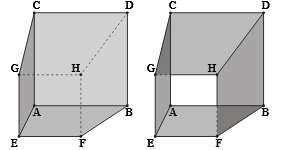
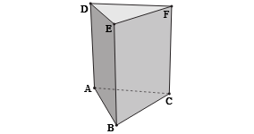
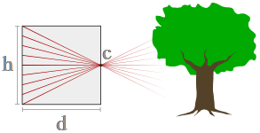

# Exercises 01: Intro to Computer Graphics

## Modeling with Meshes

In lecture we looked at one very basic way to digitally encode geometry: a list of vertex positions V, and a list of edges E given as pairs of vertices. For instance, we can encode a cube using vertices

            x  y  z
        0: -1 -1 -1
        1: +1 -1 -1
        2: +1 -1 +1
        3: -1 -1 +1
        4: -1 +1 -1
        5: +1 +1 -1
        6: +1 +1 +1
        7: -1 +1 +1

and faces

        (3, 0, 1, 2) 
        (0, 4, 5, 1) 
        (1, 5, 6, 2) 
        (2, 6, 7, 3) 
        (3, 7, 4, 0) 
        (5, 4, 7, 6) 

1. Suppose we want to describe a closed box (with all six faces) versus an open tube (with two faces missing). Can our vertex-edge encoding distinguish between these two shapes? If not, what could you do instead? What specific data structure(s) might you use to store this data?

    Without knowing the faces, it is not possible to differentiate between open and closed tubes. The data structure will have to include not just the vertices and edges, but the faces as well, similar to the example provided. A better approach would be using the Half-Edge Data Structure, in which each edge references to a corresponding else if it exists, allowing the computer to distinguish between an open and closed tube, without having to store the faces.

2. Let's say we now want to encode a triangular prism rather than a cube. How would our encoding need to change? What data structure(s) might you use to store this data?

    A triangular prism has 5 faces: 2 triangular faces and 3 rectangular faces. We can define each face by listing its vertices in a consistent order (either clockwise or counterclockwise).

    Bottom triangular face: (A, B, C)
    Top triangular face: (D, E, F)
    Rectangular face connecting vertex A and D: (A, B, E, D)
    Rectangular face connecting vertex B and E: (B, C, F, E)
    Rectangular face connecting vertex C and F: (C, A, D, F)

So far we can describe shape, but what about motion? Which part of the encoding do we need to augment? What additional data could we store? (There are many good answers to this question!)

## Through the Looking Glass
### Pinhole camera looking at tree

In lecture we gave a very basic explanation of perspective distortion using the "pinhole camera" model. Let's play with our pinhole camera to get a deeper understanding of this phenomenon. In particular, suppose the pinhole is at a point c, and the box containing our film has depth d and height h. The image is formed by light hitting a piece of film at the back of the box.

1. When we first develop our film, we notice the image is upside-down. Why? What other optical device flips an image? How might you "correct" the orientation of the image in your pinhole camera?

        When rays of light pass through the pinhole, the top rays reach the bottom of the film and the bottom rays reach the top of the film, owing to the angles they are reflected at. Lenses are used to flip images, and can be used to correct images as well. Images may also be corrected digitally or just by flipping upside down.

2. What happens to the image if we keep c where it is, but make h bigger?

        The picture does not change, we just have empty space at the top and bottom of the film then.

Smaller?

        The entire image is not projected onto the film and some of it ends up on the base (d's side)

What happens to the image if we keep c where it is, but make d bigger?

        The image projected on the film becomes larger by spreading it out.

Smaller?

        The image projected on the film becomes smaller by being more compressed.

3. What happens to the image if we fix c, but make d and h bigger at the same rate. For instance, suppose we use a pinhole camera of depth 2d and height 2h.

        The image becomes twice its size, proportions will remain the same.

4. What's the difference between moving the box forward vs. making d bigger? Do they result in an identical image? 

        Moving the box closer to the object changes the relative distance between the object and the pinhole, resulting in a larger image on the film, as the object appears closer and larger from the pinhole's perspective.

        Increasing d results in a larger image on the film, but the increase in size is due to the light rays spreading out more before hitting the film.

5. If not, what's the difference in appearance?
Compute the angle of view (theta). Does the formula you get for this angle agree with the observations above?

        θ=2arctan(h/2d)

       Increasing h: the angle of view θ increases (larger film height captures more of the scene vertically).

       Decreasing h: If h decreases, the angle of view θ decreases, capturing less of the scene vertically.

       Increasing d: If d increases, the angle of view θ decreases, focusing on a narrower field of view.

       Decreasing d: If d decreases, the angle of view θ increases, capturing a wider field of view.