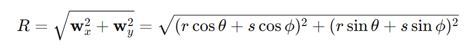
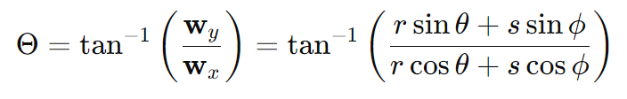

# Exercises 02: Linear Algebra (P)Review
________________________________________
## Canonicalizing Things
1.	Suppose we're given a vector u in rectangular coordinates u = (x,y). How do we convert it to polar coordinates (r,θ)?

x = rcosθ
y = rsinθ

 
2.	Suppose we have two vectors u, v expressed in polar coordinates u = (r,θ) and v = (s,φ). How do we add them (assuming we also want the sum in polar coordinates)?
Convert rom Polar to Cartesian Coordinates:

    For U = (r, θ):

Ux = rcosθ

Uy = rsinθ

For V = (s, φ):

Vx = scosφ

Vy = ssinφ

Add the vectors in cartesian coordinates

Wx = Ux + Vx = rcosθ+scosϕ

Wy = Uy + Vy = rsinθ+ssinϕ

Compute the magnitude R of the resulting vector W:

Compute the angle Θ of the resulting vector W:

w=(R,Θ)

3.	Suppose you have a vector x in the plane with components a1, a2, expressed in the basis u1, u2. How do you write this vector in the standard basis e1 = (1,0), e2 = (0,1)? Do not assume that u1 and u2 are orthonormal.

4.	Now suppose x = (x1,x2) is instead expressed with respect to the standard basis e1 = (1,0), e2 = (0,1) i.e., x = x1 e1 + x2 e2. How do we re-write x in the orthonormal basis u1, u2? I.e., if we want to write it as x = a1 u1 + a2 u2, how do we get the coefficients a1, a2?

    Since basis vectors are orthonormal, coefficients a1 and a2 can be found using inner (dot) product.

    a1 = **x**.**u1**,      a2 = **x**.**u2**

    a1 = **x**.**u1** = (x1.**e1** + x2.**e2**)**u1** = x1(**e1.u1**) + x2(**e2.u2**)

    **e1** = (1, 0)
    **e2** = (0, 1)

    a1 = x1u11 + x2u21

    a2 = **x.u2** = (x1**e1** + x2**e2**)**u2** = x1(**e1.u2**) + x2(**e2.u2**)

    a2 = x1u12 + x2u22

    ### x in orthonormal basis {u1, u2}
        U = |u11    u12|
            |u21    u22|

        a1 = x1u11 + x2u21
        a2 = x1u12 + x2u22

5.	Suppose we have the same setup as in the previous question, but u1 and u2 are no longer orthonormal. How do we now re-write x in the basis u1, u2? I.e., how do we get the coefficients a1, a2? How does the answer to this question relate to the answer to the previous question?

6.	Finally, suppose x is expressed in a non-orthonormal basis u1, u2, and we want to re-write it in another non-orthonormal basis v1, v2. What should we do?

    Approach 1: Conversion from one non orthonormal basis to standard basis, then to the next non orthonormal basis

    Approach 2: Direct conversion from one non orthonormal basis to another non orthonormal basis

## Don't Be Dense
A lot of the matrices we work with in computer graphics (and other fields, like vision and machine learning) have only a small number of nonzero entries. Consider for instance the identity matrix, which has 1's along the diagonal; all other entries are 0. Other common matrices (such as the graph Laplacian) will also be mostly 0's. For this reason there are two basic ways to store a matrix A:
•	Dense—Store every single entry Aij, whether or not it's equal to zero.
•	Sparse—Store only the entries where Aij does not equal zero (and implicitly assume all other entries are zero).
1.	How might you encode dense matrices (i.e., what kind of data structure?).

    Since dense matrices mostly consist of non zero numbers, it is suitable to store those matrices in the form of arrays.

2.	How might you encode sparse matrices (i.e., what kind of data structure?).

    Since sparce matrices consist mostly of zeros, it is not suitable to store all the values in arrays, it is more suitable to create a table storing the value and the position of the value in the matrix.

3.	What's the cost of storing an n x n identity matrix using the two encodings described above?
    
    Dense: O(n^2)

    Sparce: O(n)

