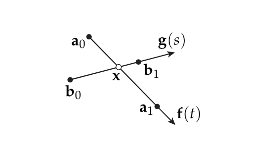

# Exercises 03: Vector Calculus (P)Review

## Don't Make Me Cross
A very common task in graphics is computing the point where two line segments meet. This computation might be needed, for instance, to clip a triangle against the edges of the screen, or check if two shapes overlap in a physical simulation. But how do we find an intersection, concretely?

In particular, let's consider two line segments with endpoints (a0, a1) and (b0, b1) in the plane. We'll consider three different ways to compute the intersection point x (if it exists).

### Implicit approach

One way to interpret a system of linear equations is that you're looking for the point where a collection of lines (or planes, etc.) intersect. But how do you turn lines into equations?

Write down an affine equation that characterizes all points x on the line through a0 and a1. Now do the same for b0, b1.

    a0 = (x0, y0)
    a1 = (x1, y1)

    b0 = (u0, v0)
    b1 = (u1, v1)

    For line through a0 and a1:
    (y1 - y0)x - (x1 - x0)y + (x1y0 + x0y1) = 0

    For line through b0 and b1:
    (v1 - v0)x - (u1 - u0)y + (u1v0 - u0v1) = 0

    

Write down a linear system Ax=b for the intersection point x. You do not need to solve this system, but should give explicit expressions for the entries of the matrix A and the vector b (so that you could in principle hand it off to a linear solver).

What does it mean geometrically if the system does not have full rank?

    The lines either do not intersect at all, or they intersect at multiple points (can be on top of each other), providing either no solutions at all, or no unique solution.

Suppose the linear system has full rank, and the solver produces the intersection point x. How can we check whether it is contained in the two segments?

### Explicit approach

A different way to describe a line is to think of it as a ray r(t) = o + td that starts at some origin o and travels in some direction d for time t. (To trace out the rest of the line, we can just go in the opposite direction -t.)

Write down a ray f(t) along the segment (a0,a1), and another ray g(s) along the segment (b0,b1).

What linear system can you solve to determine the intersection? Give the entries of this system explicitly. To obtain the final intersection point x, what else do you have to do beyond just solving the linear system?

How do you know if the intersection point is contained in the segments?

    If t and s are between 0 and 1, that means the intersection takes place between the start and the end points of the line segments.

### Homogeneous approach
Point as line in homogeneous coordinates

There's a much simpler way to compute the intersection of two lines, using this "one weird trick" called homogeneous coordinates. The basic idea is to turn every point in 2D into a whole line in 3D. Certain computations on these 3D lines are then much easier than the corresponding calculations on points in 2D. More precisely, any point x in 2D gets associated with all points of the form X = (cx,c), where c is any nonzero constant. If we vary c, we see that these points trace out a line in 3D. Often, we let c=1 and use (x,1) as the canonical representative, corresponding to a point in the 2D plane at height 1 above the origin.

If we consider all 2D points along the 2D line through a0 and a1, what shape do all the corresponding 3D points describe in 3D? How about b0 and b1?

Geometrically, which line in 3D corresponds to our 2D intersection point x?

How can we compute this line explicitly, using only the homogeneous coordinates A0, A1, B0, and B1? [Hint: your final expression for the intersection point should be really simple!]

1. Convert endpoints to homogeneous coordinates: Each 2D point (x,y) is converted to homogeneous coordinates (x,y,1).

2. Compute the lines in homogeneous coordinates: Use the cross product to find the homogeneous coordinates of the lines through the given endpoints.

3. Find the intersection of the lines: Compute the cross product of the two lines in homogeneous coordinates to find the intersection point, which will be the direction vector of the 3D line.

​
