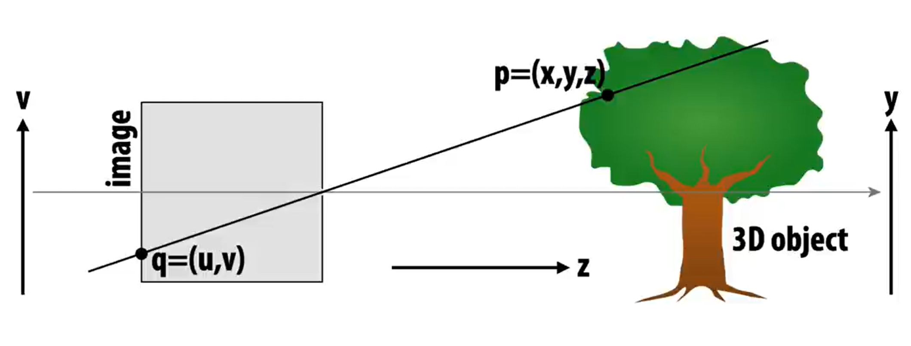
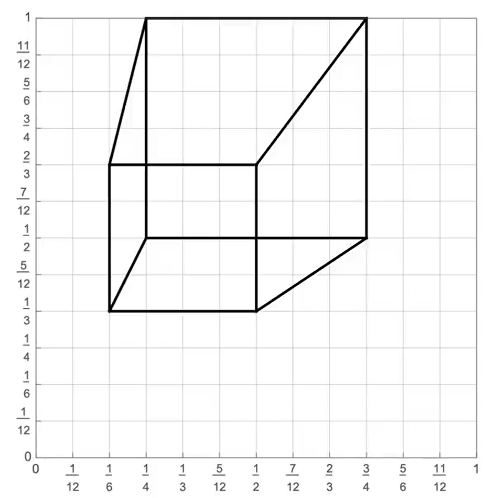
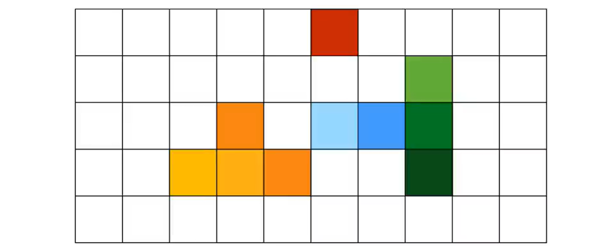
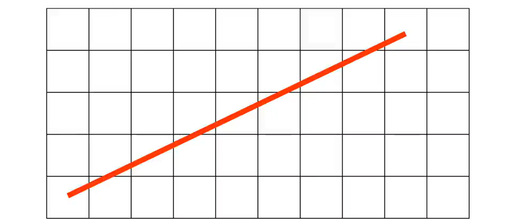
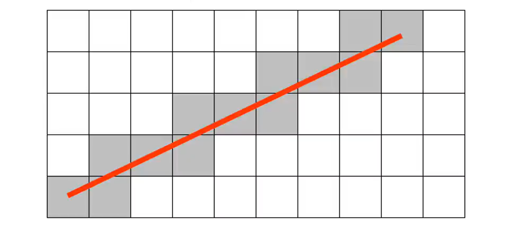
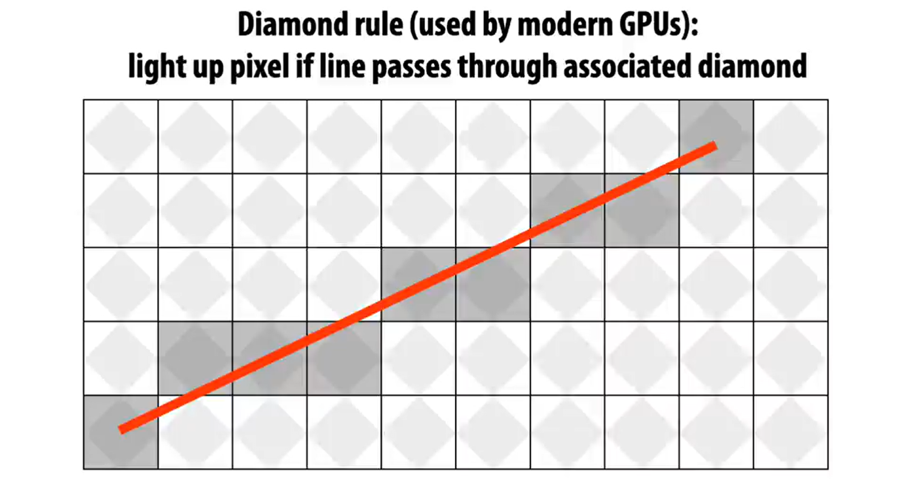

# Lecture 01: Course Overview (CMU 15 - 462 / 662)

## ACTIVITY: MODELING A CUBE (from CMU lecture 01)

Suppose a cube is:

- centred at origin
- has dimensions $2 \times 2 \times 2$
- edges aligned withe $x / y / z$ axes

With coordinates:

$A:(1,1,1) \quad E:(1,1,-1)$

$B:(-1,1,1) \quad F:(-1,1,-1)$

$C:(11,-1,1) \quad G:(1,-1,-1)$

$D:(-1,-1,1) \quad H: (-1,-1,-1)$

We now have to find the edges.

$A B, C D, E F, G F, A C, B D, E G$,

$F H, A E, C G, B F, D H$.

*This is called the **modelling stage**, where we find out what to place where and how.*

#### How do we draw this 3D shape as a 2D flat image?

This process is called rendering.

$3 \mathrm{D}$ coordinates $\xrightarrow{ \text { map }} 2D$ coordinates

#### How?

1. Perspective Projection

- Near objects boo big, far objects look small, why?

$\frac{v}{1}=\frac{y}{x}$ horizontal coordinate 

This means that to go from 3D to 2D, all you have to do is divide by $z$.

$v=y / z \quad u=x / z \quad$ 

Let's try it!

- Assume camera c is at $(2,3,5) \quad$ 

    1. Subtract c from $(x, y, z)$ toget and $(u 2, v 2)$
    
        Convert $(x, y, z)$ to $(u, v) \quad$ 

        $(3D$ location of points relative to the camera).

    2. divide $(x, y)$ by $z$ toget $(u, v)$ 

        Draw a line between (u1, v1)

Let's toy some of them

A

$$
\begin{aligned}
& (1,1,1)-(2,3,5) \\
& =(-1,-2,-4) \\
& \quad(-1,-2) \div-4=(1 / 4,1 / 2)
\end{aligned}
$$

B.

$$
\begin{aligned}
& (-1,1,1)-(2,3,5) \\
& (-3,-2,-4) \\
& (-3,-2) \div-4=(3 / 4,1 / 2)
\end{aligned}
$$

C.

$$
\begin{aligned}
& (1,-1,1)-(2,3,5) \\
& (-1,-4,-4) \\
& (-1,-4) \div-4=(1 / 4,1)
\end{aligned}
$$

D.

$$
\begin{aligned}
& (-1,-1,1)-(2,3,5) \\
& (-3,-4,-4)+18 \\
& (-3,-4) \div-4=(+3 / 4,1)
\end{aligned}
$$

and so on.

$$
\begin{aligned}
& E:(1 / 6,1 / 3) \\
& F:(1 / 2,1 / 3) \\
& G:(1 / 6,2 / 3) \\
& H:(1 / 2,2 / 3)
\end{aligned}
$$

You come up with something like this by implementing the algorithm:

How to draw lines on a computer? 

How are images represented on a compute?
We **rasterize**

- colour on a grid.
- each box, i.e. pixel, holds a newer numerical value.

### RASTERIZATION

#### Original

#### Lighing up all pixels intersected by line

#### Diamond Rule

Incremental tine Rasterization Algorithm

$$
\begin{aligned}
& v=v 1 \\
& \text { for }(u=u 1; u<u 2; u++)\{ \\
& v+=s \\
& \quad \operatorname{draw}(u \text {, round }(v)) \\
& \}
\end{aligned}
$$

