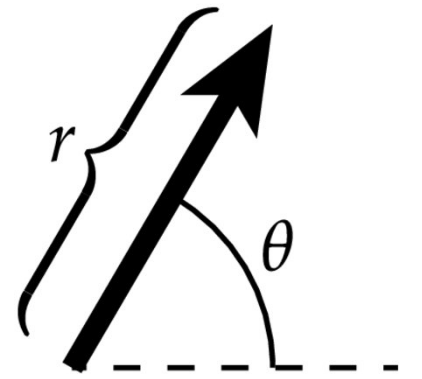
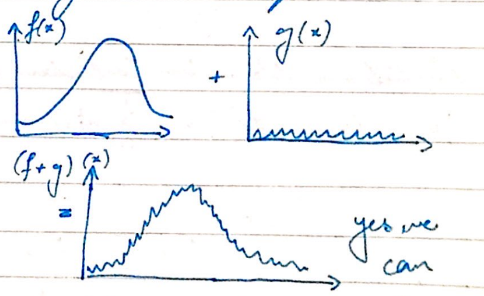
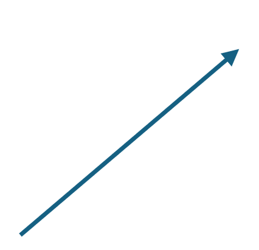
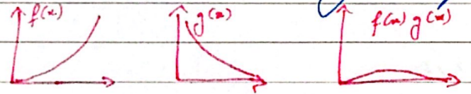

# Lecture 02: Linear Algebra (cmu15-462/662)

- vector: direction and magnitude

- $r$ and $\theta$-polar coordinates

$r$ and $\theta$ cannot be implemented in the cartesian coordinate system, you need $(x, y)$ for that system.

#### Rules of a Vector Space:

$\underline{u}+\underline{v}=\underline{v}+\underline{u}$

$\underline{u}+(\underline{v}+\underline{\omega})=(\underline{u}+\underline{v})+\underline{\omega}$

$\underline{v}+\underline{0}=\underline{0}+\underline{v}=\underline{v}$ ( Zero vector )

$\underline{v}$ has $-v  \quad \underline{v}+(-v)=0$

$1\underline{v} = \underline{v}$

$ a(b \underline{v})=b(a \underline{v})=(a b) \underline{v} $
$(a+b) \underline{v}=a \underline{v}+b \underline{v}$

If an object obeys these rules, even if it is not an arrow, it is still a vector space.

### Functions as vectors

A function could be the intensity of am image, could describe a piece of geometry, amplitude of sound vibration.

Can you add two functions?

Similarly for do the same for the rest.

Yes we can.

### Norm of a Vector

length, norm, magnitude - used interchangeably.

Intuitively - now should capture how big the vector is.

### Natural Properties of Length

$$
|c \underline{u}|=c|\underline{u}| \quad \underline{u}+\underline{v}|\underline{u}|+|\underline{v}| \geq|\underline{u}+\underline{v}|
$$

Norm: Formal Definition

Norm is any function that assigns a member to each vector and satisfies the following properties.

$$
\begin{aligned}
& |\underline{v}| \geq 0 \\
& |\underline{v}| \geq 1=0 \\
& |a \underline{v}|=|a||\underline{v}| \\
& |\underline{u}|+|\underline{v}| \geq|\underline{u}+\underline{v}|
\end{aligned}
$$

### Euclidean Norm in Cartesian Coordinates

$ \underline{u}=(4,2) \\$

$ |u|=\sqrt{4^{2}+2^{2}}=\sqrt{20}  =2 \sqrt{5}$

Does this formula satisfy all the natural, geometric properties of a noun?

### $L^{2}$ Norm of Functions

Note that this formula is almost the same as the previous one except that this is continuous.

Note that the formula does not exactly salify, all the popeutics, because in accordance \#to the pepenties, it is not just the zee vector that cow have the zero nom, as the discontiomities are rumored by the integration.

Function $f(x) .1$ for $x=0.5$, else $f(x)=0$ proves that.

Example:

Find the $L^{2}$ form of $f(x)=x \sqrt{3}$

$$
\sqrt{\int_{0}^{\prime}(x \sqrt{3})^{2} d x}=\sqrt{\int_{0}^{1} 3 x^{2} d x}=\sqrt{\left.x^{2}\right|_{0} ^{1}}=\sqrt{1^{3}-0^{3}}=\sqrt{1}=1 .
$$

Inner Product - Projecting and Scaling.
The angle between two vectors is vul.

The angle between tor vectors is very important to def determine the similacitige between the two, how well aligned are the thor rectors.

$$
\langle v, u\rangle=\underbrace{\langle u, v\rangle}
$$

length of the projection $v$ onto you

If you scale me of the vectors, the miner product will also be scaled

$\langle u, v\rangle$ being the sige of the shadow oast by. the nit nclor $v$ on $u$ them doubling is length should cast a shadow of thrice the length

$$
\langle 2 u, v\rangle=2\langle u, v\rangle
$$

$\langle\underline{u}, \underline{u}\rangle=1$ (with $n$ being a not vector) if $n$ is not a unit vector, then what is $\langle\underline{u}, \underline{u}\rangle$ equal to?

$$
\begin{aligned}
& \hat{u}=\underline{u}/|u| \rightarrow\langle\underline{u}, \underline{u}\rangle=\langle\hat{u}|u|, \hat{u}|u|\rangle \\

& =|u|^{2}\langle\hat{u}, \hat{u}\rangle \\

& =|u|^{2} \cdot 1=|u|^{2} \\
\end{aligned}
$$

$$
\begin{aligned}

& \langle\underline{u}, \underline{v}\rangle=\langle\underline{v}, \underline{u}\rangle \\

& \langle\underline{u}, u\rangle \geqslant 0 \\

& \langle\underline{u}, \underline{u}\rangle=0 \Leftrightarrow \underline{u}=0 \\

& \langle\underline{u}+\underline{v}, \underline{u}\rangle=\langle\underline{u}, \underline{w}\rangle+\langle\underline{v}, \underline{w}\rangle
\end{aligned}
$$

$L^{2}$ Inner Product of Functions

Just like how we had norms for functions, we can use the innr product to see how well they line up.

Think of the functions as vectors in an infinite dimensional space.

#### Measuring Images

if we use norm to find the interesting image, it will give the cloud, even though the cat is the interesting one. To cater to this, we make use fo the edges in the photos by taking the derivative. The more the edges, the more interesting it is.

#### Linear vs Affine Maps

Linear mapping results in an image always passing through the origin.

Affine - does not pass through the origin.

The bottom image is definitely not linearly mapped, given the non linear shape.

### Span

Set of all vectors that can be written as a linear combination.

$$
\begin{aligned}
& a \underline{u}+b \underline{v} \\
& \operatorname{span}\left(\underline{u}_1, \ldots, \underline{u}_{k}\right)=\left\{\underline{x} \in V \mid \underline{x}=\sum_{i=1}^{k} a_{i} \underline{u}_{i}, a_{1}, \ldots, a_{k} \in \mathbb{R}\right\}
\end{aligned}
$$

## Span and Linear Maps

Linear mop

image of a function all the points that cam be reachool by

applying a function ito its domain.

Basis

$$
\operatorname{span}\left(e_{1}, \ldots, e_{n}\right)=\mathbb{R}^{n}
$$

orlónormal

Gram Schmidt

Used to find othonounal basis from a given wet of basis vectors.

Gram Schmidt Nhoratmm

- nomadize the first recto- (ic divide by its leech)
- subtract any component of the frost ave fam the second one.
- nomalize $2^{n}$
- seat, sowing components of fist $k$ vectors from $k+1$.

Fourier Transform

Imuctians aloollave an orthonormal basis.

System of Linear Equations

$x+2 y=3$ Unknown values are sometimes called "degrees of $4 x+5 y=6 \quad$ freedom; equations are sonstines called "constraints" $y=2 \quad x=-1$

affine since the yetemu does not

Uniqueness, Existence of Solution e.

any paint alar the hire.

no solution.

not every paint com be "reached" by $f$

matrices can be used for

1. symbolic manipulation 2 .munerical computation

$$
\begin{aligned}
& f(u)=u_{1} a_{1}+u_{2} a_{2} \\
& \text { how to encode as a matrix? } \quad A=\left[\begin{array}{ll}
a_{1}, x & a_{2}, x \\
a_{1}, y & a_{2}, y \\
a_{1}, 2 & a_{2}, z
\end{array}\right] \\
& {\left[\begin{array}{ll}
a_{1}, x & a_{2}, x \\
a_{2}, y & a_{2}, y \\
a_{1}, 2 & a_{2}, 2
\end{array}\right]\left[\begin{array}{l}
u_{1} \\
u_{2}
\end{array}\right]=\left[\begin{array}{ll}
a_{1}, x u_{1}+a_{2}, x u_{2} \\
a_{1}, y u_{1}+a_{2}, y u_{2} \\
a_{1}, z u_{1}+a_{2}, 3 u_{2}
\end{array}\right]}
\end{aligned}
$$

