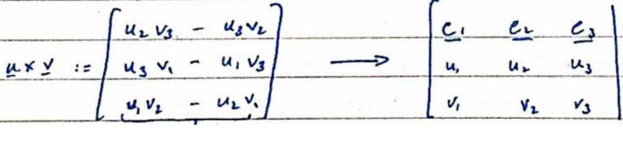

# Lecture 03: Vector Calculus (P) Review (CMU 15-462/662)

### Euclidean Norm
- any notion of length preserved by rotations/ translations/reflections of a space.

#### Euclidean norm in othonormal coordinates

$$
|\underline{u}|=\sqrt{u_{1}^{2}+\ldots+u_{n}^{2}}
$$

**Warning**:
This quantity does not encode geometric length unless vectors are encoded in an orthonormal basis.

**Inner Product**: measure some notion of alignment.

For geometric calculations we should use Euclidian Product.

**For n-dimensional vectors**

$ \langle\underline{u}, \underline{v} \rangle:=| \underline{u}|| \underline{v}| \cos (\theta) $
independent of coordinates

**Dot Product**: Makes use of coordinates. Inner product in orthonormal Cartesian coordinates can be taken by taken the dot product of the two vectors.

$$
\underline{u} . \underline{v}=u_{1} v_{1}+\ldots+u_{n} v_{n}
$$

**Warning**: this has no geometric meaning unless coordinates come from orthonormal basis.

### Cross Product

In dot product, you have two vectors and you produce a scalar product. In cross product you produce a vector product using two vectors.

- magnitude equal to parallelogram area
- direction orthogonal to both vectors

**This definition only makes sense in 3D. Why?**

Why not in 2D?

In 2D both vectors will have to be parallel to each other, only then they can have something orthogonal.

**A more precise definition:**
$$
\begin{aligned}
& \sqrt{\operatorname{det}(\underline{u}, \underline{v}, \underline{u} \times \underline{v})}=|\underline{u}||\underline{v}| \sin \theta
\end{aligned}
$$

(Mneumonic on the right)

Useful abuse of expression in 2D: $\underline{u} \times \underline{v} = {u}_1 {v}_2 + {u}_2 {v}_1$

### Cross Product as Quarter Rotation

$$
\begin{aligned}
& N \times u \rightarrow \text { rotation of } \underline {u} \text { by } 90^{\circ} \\
& N \times(N \times u) \rightarrow \text { rotation of } \underline{u} \text { by } 180^{\circ} \text {, i.e. }-\underline{u} \text {. }
\end{aligned}
$$

Q How to get rotation by some arbitiany value $\theta$ ?

$$
u \cos \theta+ (n \times u) \sin \theta
$$

Matrix Representation of Dot Product

$$
\underline{u} \cdot \underline{v}=\underline{u}^{\top} \underline{v}=\left[\begin{array}{lll}
u_{1} & \ldots & u_{n}
\end{array}\right]\left[\begin{array}{l}
v_{1} \\
... \\
v_{n}
\end{array}\right]=\sum_{i=1}^{n} u_{1} v_{i}
$$

If we have to take an inner product of $\langle u, v\rangle$ where

$$
\begin{aligned}
& \langle u, v\rangle:= 2 u_{1} v_{1}+ u_{1} v_{2}+u_{2} v_{1}+3 u_{2} v_{2}
\end{aligned}
$$

Why is the matrix representing the inner product always symmetric?

$\left(A^{\top}=A\right)$

$$
\begin{aligned}
&\langle u, v\rangle=\underline{u}^{\top} A \underline {v} \\

&\langle v, u\rangle=\underline{v}^{\top} A \underline{u} \\
& \underline{u}^{\top} A \underline{\underline{v}}=\underline{v}^{\top} A \underline{u} \\
& v_{\underline{x}^{\top}} \Delta \underline{u}=\left(\underline{u}^{\top} A_{\underline{v}}\right)^{\top} \\
& \underline{v}^{\top} A \underline{u}=\underline{v}^{\top} A \underline{u} \\
& \underline{u}:=\left(u_{1}, u_{2}, u_{3}\right) \Rightarrow \hat{u}:=\left[\begin{array}{ccc}
0 & -u_{3} & u_{2} \\
u_{3} & 0 & -u_{1} \\
-u_{2} & u_{1} & 0
\end{array}\right] \rightarrow \text { skew symmetric } \\
& \underline{u} \times \underline{v}=\underline{\hat{u}} \underline{v}=\left[\begin{array}{ccc}
0 & -u_{3} & u_{2} \\
u_{3} & 0 & -u_{1} \\
-u_{2} & u_{1} & 0
\end{array}\right]\left[\begin{array}{l}
u_{1} \\
v_{1} \\
v_{3}
\end{array}\right]
\end{aligned}
$$

$$
\underline{v} \times \underline{u} = - \underline{\hat{u}} \times \underline{v}
$$ 
(since it is skew symmetric)
$$
\underline{v} \times \underline{u} = -\underline{u} \underline{v} 
$$

$$
\begin{aligned}
& \underline{v} \times \underline{u}=-{\underline{u}} \underline{v}=\hat{u}^{\top} v
\end{aligned}
$$

Determinant:

*triple product formula*

base area . height = volume

### Representing Linear Maps via Matrices
$f(u) = {u}_1 \underline{a}_1 + {u}_2 \underline{a}_2 + {u}_3 \underline{a}_3$

$\checkmark$ when trling fïe. detesminant, lle sign chomges

How to code $f(u)$ as a matrix?

$$
\left[\begin{array}{lll}
a_{1 x} & a_{2 x} & a_{3 x} \\
a_{1 y} & a_{2} y & a_{12} \\
a_{12} & a_{12} & a_{3} z
\end{array}\right]\left[\begin{array}{l}
u_{1} \\
u_{2} \\
u_{3}
\end{array}\right] \quad \begin{array}{ll}
\text { what does the determinate } \\
& \text { of a matrix that encodes } a \\
\text { linear map tell you? }
\end{array}
$$

linear mop

the tranglomation takes place when applying the lineal mop the determinant would symbolic the change in volume

what does a negative sign indicate in case of a linear map?

$\rightarrow$ shows that the orientation is reversed

$$
\operatorname{det}(g)=-\operatorname{det}(f)
$$

Other Triple Products

Var useful for working with vectors in 30 . this shows that deter minants aredentisely geometric concept for which coordinates are not needed.

Jacobi identity for coss product.

$$
\begin{aligned}
& u \times(v \times \omega)+ \\
& v \times(w \times u)+ \\
& w \times(u \times v)=0
\end{aligned}
$$

Lagrange's idurtily: $u \times(v \times \omega)=v(u \cdot w)-\omega(u \cdot v)$

Differential Opuators - Onewiew

Differential operators ne duinatives that act on vector fields.

Why differentiation?

- sg simulating plysios/geometry expressed in terms of $O D E_{s}$ or PREs. (relative rates of change)
- numerical optimization -minimise cost by following gradient of some objective.

Derivative as Slope.

$$
\begin{aligned}
& f(x): R \rightarrow R \quad \text { "rise over } \\
& f^{\prime}\left(x_{0}\right)=\lim _{\varepsilon \rightarrow 0} \frac{f\left(x_{0}+\varepsilon\right)-f\left(x_{0}\right)}{\varepsilon}
\end{aligned}
$$

$$
\text { "rise over run" }
$$

Differentiable at so if $f^{+}$. $f^{-}$

if going for word and going

backward have the same slope

Derivative as Best Linear Approximation

Wy smooth function $f(x)$ cam be expused as Taylor Series.

$$
f(x)=f\left(x_{0}\right)+f^{\prime}\left(x_{0}\right)\left(x-x_{0}\right)+\frac{\left(x-x_{0}\right)^{2}}{2!} f^{\prime \prime}\left(x_{0}\right)+\cdots
$$

How do we think about derivatives for a function that has multiple variables?

Directional Derivative.

Instead of having a function with one valuable, we have a function with two variable.

Q) $\operatorname{Duf}\left(x_{0}\right)=\lim _{\varepsilon \rightarrow 0} \frac{\delta f\left(x_{0}+\varepsilon \underline{u}\right)-f\left(x_{0}\right)}{\varepsilon}$
change in function fo along all possible directions $u$.

refer to gradient slide showing the g blue gradicut being represented as arrows.

Gradient in Coordinates

$\begin{aligned} & \text { list of partial derivatives } \\ & \text {-imagine all but one offer the coordinates are } \\ & \text { just constant values, and tale usual derivative }\end{aligned} \quad \nabla f=\left[\begin{array}{c}\partial f / \partial x_{1} \\ \vdots \\ \partial f / \partial x_{n}\end{array}\right]$

Two potential problems:

- Role of inner product not clear
- No way of differentiating functions of functions $F(f)$ since they damifl have finite list of coovalinates.

Simple:

$$
\begin{aligned}
& f(x)=x_{1}^{2}+x_{2}^{2} \\
& \frac{\partial f}{\partial x_{1}}=2 x_{1}+0 \\
& \frac{\partial f}{\partial x_{2}}=2 x_{2} \\
& \nabla f(x)=\left[\begin{array}{l}
2 x_{1} \\
2 x_{2}
\end{array}\right]=2 \underline{x}
\end{aligned}
$$

Stacking at $x_{0}$, the term gets:

- bigger if we move in the direction of the gradient
- Smaller if we move in the opposite direction
- does not change if we more orthogonal to the gradicul.-

We use gradient for "steepest ascent", used for optimization

Gradient and Direction Derivative.

$\nabla f(\underline{x}) \rightarrow$ gradient is a unique vector

$$
\langle\nabla f(x), u\rangle=D_{u} f(\underline{x})
$$

taking inner product with rector gives directional derivative ni any not possible if the function is not differentiable.

Gradient of Dot Product.

What is the gradient of $f$ with respect to $u$ ?

$$
\begin{aligned}
& u^{\top} v=\sum_{i=1}^{n} u_{i} v_{i} \\
& \text { in other words } \\
& \frac{\partial}{\partial u_{k}} \sum_{i=1}^{n} u_{i} v_{i}=\sum_{i=1}^{n} \frac{\partial}{\partial u_{k}}\left(u_{i} v_{i}\right)=v_{k} \\
& \nabla \underline{u}\left(\underline{u}^{\top} \underline{v}\right)=\underline{v} \\
& \nabla_{s} f=\left[\begin{array}{c}
v_{1} \\
\vdots \\
v_{n}
\end{array}\right]
\end{aligned}
$$

### Matrix Derivative

$$
\begin{aligned}
& \nabla_{x}\left(\underline{x}^{\top} y\right)=\underline{y} \\
& \nabla_{x}\left(\underline{x}^{\top} \underline{x}\right)=2 \underline{x} \\
& \nabla_{x}\left(\underline{x}^{\top} A_{y}\right)=A \underline{y} \\
& \nabla_{x}\left(\underline{x}^{\top} A_{\underline{x}}\right)=2 A \underline{x}
\end{aligned}
$$

$$
\begin{aligned}
& \text { Looks Like } \\
& d / d x x y=y \\
& d / d x x^{2}=2 x \\
& d / d x a x y=a y \\
& d / d x a x^{2}=2 a x .
\end{aligned}
$$

Visual Example: $L^{2}$ Gradient-

$$
F(f)=\ll f, g>\text { for } f, g:[0,1] \rightarrow R \text {. }
$$

inner product measures how well aligned two entities are.

So to align $f$ with $g$ me need to add a little bit of $g$ to $f$.

$$
F(f)=\|f\|^{2} \text { for arguments } f:[0,1] \rightarrow R \text {. }
$$

It each point to me want

$$
\begin{aligned}
& \left\langle\left\langle\nabla F\left(f_{0}\right), u\right\rangle=\lim _{\varepsilon \rightarrow 0} \frac{F\left(f_{0}+\varepsilon u\right)-F\left(f_{0}\right)}{\varepsilon}\right. \\
& \text { expanding } \left.1^{3+} \text { tum: }\left\|f_{0}+\varepsilon u\right\|^{2}=\left\|f_{0}\right\|^{2}+\varepsilon^{2}\|u\|^{2}+2 \varepsilon\left\langle f_{0}, u\right\rangle\right\rangle \\
& \left.\lim _{x \rightarrow 0}\left(\varepsilon\|u\|^{2}+2\left\langle f_{0}, u\right\rangle\right)=2\left\langle f_{0}, u\right\rangle\right\rangle \\
& \left\langle\left\langle\nabla F\left(f_{0}\right), u\right\rangle\right\rangle=2\left\langle\left\langle f_{0}, u\right\rangle\right\rangle \rightarrow \nabla F\left(f_{0}\right)=2 f_{0} . \\
& \frac{d}{d x} x^{2}=2 x
\end{aligned}
$$

Vector Fields.

Gradient field was our first example of rector field.

Anector fid assigns a vedor to each point in space.

Eng. we cam thine of a 2 vector field in the plane as a map.

$$
X: \mathbb{R}^{2} \rightarrow \mathbb{R}^{2}
$$

$E \cdot g$.

$$
\nabla f(x, y)=(2 x, 2 y)
$$

(for $\left.f(x, y)=x^{2}+y^{2}\right)$.

How to measure change in a vector field?

Divergence and Cull. how much the field is sheinhinglexpanding how much the field is spinning.
Divergence .
$\nabla$.

$$
\begin{aligned}
& \left.\nabla \cdot \frac{x}{\partial}, \ldots, \frac{\partial}{\partial u}, \ldots\right) \text {-vector of derivatives. } \\
& x(\underline{u})=\left(x_{1}(\underline{u}), \ldots, x_{n}(\underline{u})\right) \text { - vector of functions. }
\end{aligned}
$$

divergence: $\nabla \cdot x=\sum_{i=1}^{n} \partial x_{i} / \partial u_{i}$

Consider $X(u, v)=(\cos (u), \sin (v))$

$$
\nabla \cdot x=\partial / \partial u \cos (u)+\partial / \partial v \sin (v)=-\sin (u)+\cos v
$$

Curl.

$$
\begin{array}{lr}
\nabla \times x & X(\underline{u})=\left(x,(s), x_{2}(\underline{u}), x_{3}(u)\right. \\
\text { suggests coordinatudefinition. } & \nabla \times x=\left[\begin{array}{ll}
\partial x_{3} / \partial u_{2}-\partial x_{2} / \partial u_{3} \\
\partial x_{1} / \partial u_{3}-\partial x_{3} / \partial u_{1} \\
\partial x_{2} / \partial u_{1}-\partial x_{1} / \partial u_{2}
\end{array}\right]
\end{array}
$$

"21) curl" $=\partial x_{2} / \partial u_{1}-\partial x_{1} / \partial u_{2}$
consider $\quad x=$ arucosa $X(u, v)=(-\sin v, \cos u)$

$$
\nabla \times X=\frac{\partial}{\partial u} \cos u-\frac{\partial}{\partial v}(-\sin v)=-\sin u+\cos v
$$

Shows: curls and divergence as complementary concepts, one can be obtained from the other by rotating rectors by $90^{\circ}$.

Laplacian

For ordinary function $f(x)$,

what doe $2^{\text {mo }}$ derivative tell no?

tie Laplacian measures "curvature" of a function.

Usually denoted by $\Delta$ (delta)

- divergence of gradient $\nabla f=\Delta f=\nabla . \nabla f=\operatorname{div}(\operatorname{grad} f)$
- sum of second partial derivatives $\Delta f-\nabla \nabla f=$ dir $($ grad $f)$ -

$$
G \Delta f=\sum_{i=1}^{n} \partial^{2} f / \partial x_{i}^{2}
$$

(second derivative of $f$ along the itu coordinated

- gradient of Dirichlet enagy $\Delta f=-\nabla_{f}\left(\frac{1}{2}\|\nabla f\|^{2}\right)$

laplacian of $f=$-gradient wort $f$ of the function $1 / 2$ norm gradient quad)

Chow to change a frmetion to make it less/more smooth as grouch $y$ oas pomolble) 1

Laplacian Example.

$$
\begin{gathered}
\Delta f=\sum_{i} \partial^{2} f / \partial x_{i}^{2} \\
f\left(x_{1}, x_{2}\right)=\cos \left(3 x_{1}\right)+\sin \left(3 x_{2}\right) \\
\frac{\partial^{2}}{\partial x_{1}^{2}} f=\frac{\partial}{\partial x_{1}}-3 \sin 3 x_{1}=-9 \cos 3 x_{1} \\
\frac{\partial^{2}}{\partial x_{2}^{2}} f=\frac{\partial}{\partial x_{2}} 3 \cos 3 x_{2}=9 \sin 3 x_{2} \\
\Delta f=-9\left(\cos \left(3 x_{1}\right)+\sin \left(3 x_{2}\right)\right) \\
\Delta f=-9 f
\end{gathered}
$$

started with a scalar function, got a scalar function

functions that were neg a lively curved become posit lively anted and vice versa

Hessian in Coordinates

Hessian - $\nabla^{2}$

gradient - vector that guess partial derivatives of the function

Hessian - operator that gives partial derivatives of the gradient

$$
\left(\nabla^{2} f\right) \underline{u}=0 \underline{u}(\nabla f)
$$

For $f(x)=R^{n} \rightarrow R$

$$
\nabla^{2} f=\left[\begin{array}{ccc}
\frac{\partial^{2} f}{\partial x_{1} \partial x_{1}} & \cdots & \partial^{2} f \\
\vdots & \ddots & \vdots \\
\frac{\partial^{2} f}{\partial x_{1}} \partial x_{n} \\
\frac{\partial x_{1}}{} & \frac{\partial f}{\partial x_{n} \partial x_{n}}
\end{array}\right]
$$

Taylor Series for Multivariable Functions $2^{\text {ad }}$ order approximation of any moth, multivariable function $f(x)$ around some point $x$, using Hessian.

$$
\begin{aligned}
& f(u) \propto 1 / 2 \underline{u}^{\top} A \underline{u}+\underline{b}^{\top} \underline{k}+c \quad u \in x_{n}-x_{0}
\end{aligned}
$$

Homogeneous Coordinates used to find point of Intersection In homogeneous coordinates, a 20 point (x, $y$ ) is given a 30 representation $\left(, x, y_{i}\right)$, where

$$
x=\frac{x}{\omega}, \quad y=\frac{y}{w} \quad(x, y) \rightarrow(x, y, w)=(c x, c y, c)
$$

for any now zero constant $c$. usually choose $c=1$ as canonical up res.

Example:

1. Line 1: $2 x+3 y+1=0$
2. Line 2: $-x+4 y-2=0$

$$
\begin{aligned}
& L_{1}=(2,3,1) \\
& L_{2}=(-1,4,-2)
\end{aligned}
$$

$\left|\begin{array}{ccc}i & j & k \\ 2 & 3 & 1 \\ -1 & 4 & -2\end{array}\right|$

$$
\begin{aligned}
& (-6-4,+4=1,8+3)=(-10,3,11) \\
& x=-10 / 11, y=3 / 11
\end{aligned}
$$

