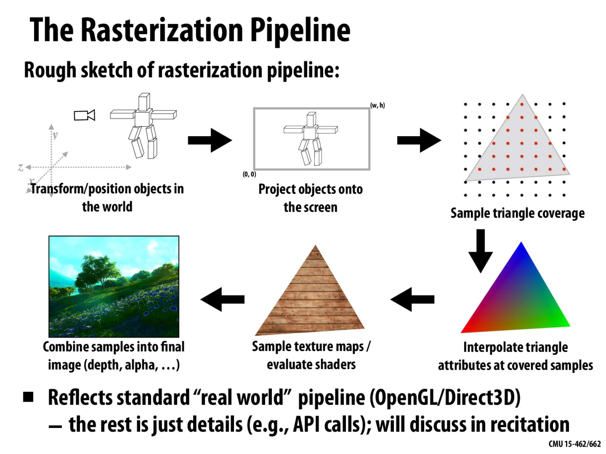
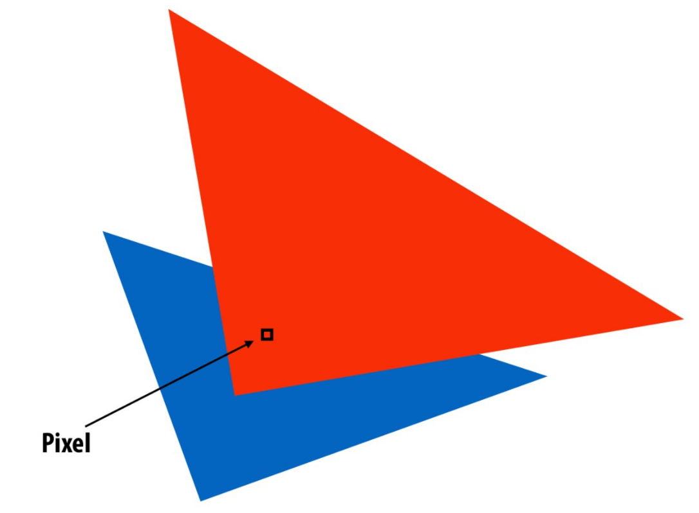
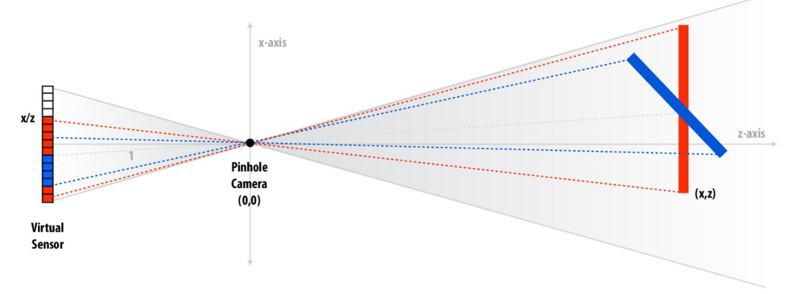
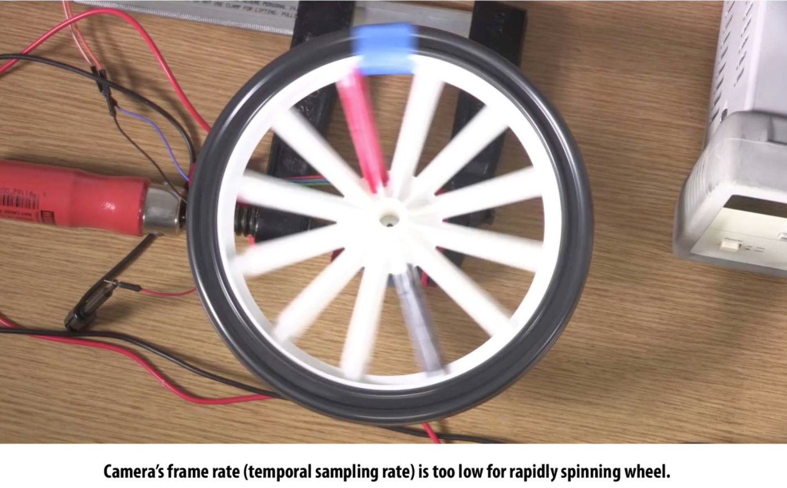
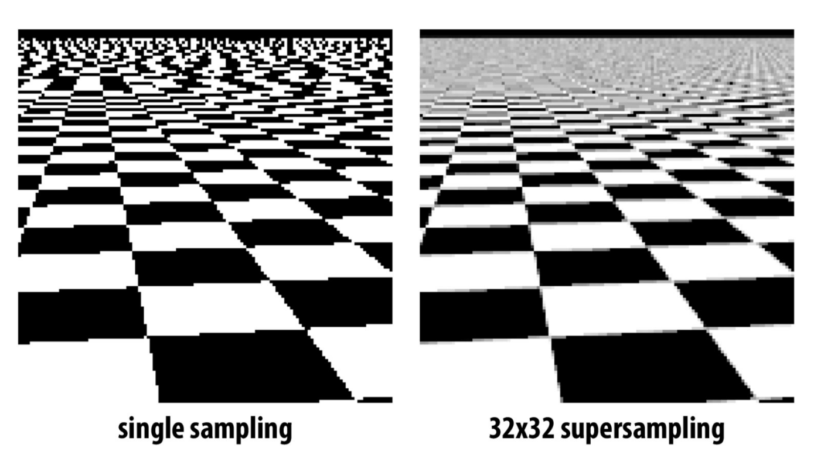
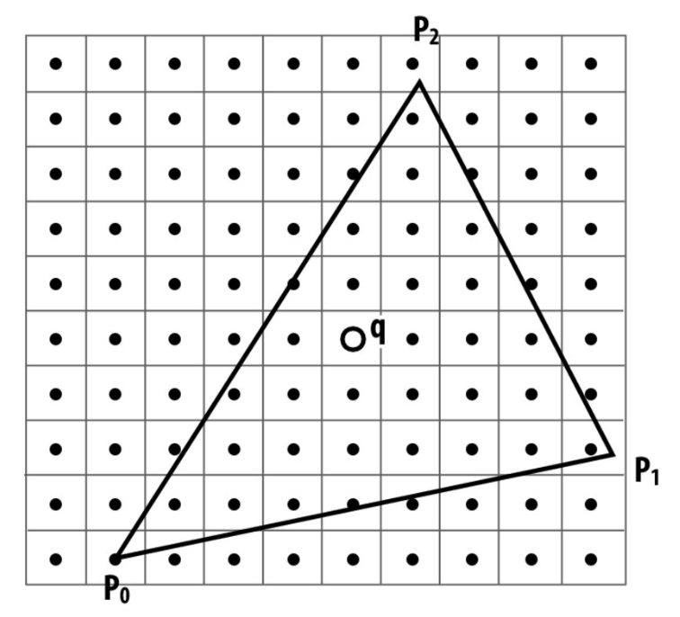

# Lecture 04: Drawing a Triangle and an Intro To Sampling (CMU 15-462/662)

Rasterization
- which pixels light up?
- good for 2D, but not realistic images.

Ray Tracing
- which primitives/triangles are seen?
- photorealism
- slower

## 3D Image Generation Pipeline
Rasterisation Pipeline

Structure computation in terms of stages - sequence of transformations

input -> processing (series of stages) -> output

GPU is highly specialized to process the rasterization pipeline.

## Triangles
- can approximate any shape
- always planar, well-deffined normal
- easy to interpolate data at corners - "barycentric coordinates"

rasterization - reducing images to triangles

## Rasterization Pipeline

## Drawing Triangles on the Screen

Q1. What pixels does the triangle overlap? ("coverage")

Q2. Which triangle is closest to theh camera in each pixel?

## The Visibility Problem

Coverage: what scene geometry is hit by a ray from a pixel through the pinhole?

Occlusion: which object is first hit along the ray?

Coverage via sampling

## Aliasing

The problem arises in the reconstruction of a signal due to undersampling.

### Images can be broken down into frequencies. To avoid error, increase samples

## Super sampling

Super sampling - dense sampling done by coverage function.

Using multiple samples for one pixel allow better estimation.

Use the fraction of sample values that are covered to get an approximation of the fraction fo the pixel that is covered.

## Point in triangle test

**How do we check if a given point q is inside of a triangle?**
Check if it is contained in the half planes associated with the edges.

Different Approaches:
- incremental (traditional)
- test all samples in parallel (modern)
- hybrid - randomly draw large boxes and see which intersects a triangle

**How do you find out if a box intersects a triangle?**
