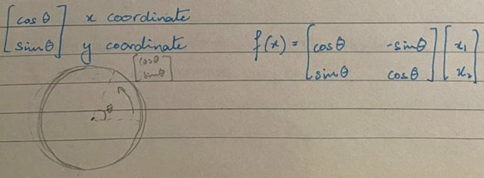
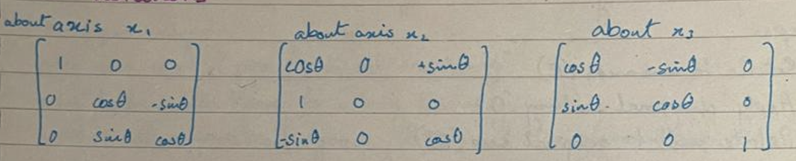
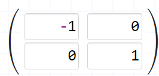
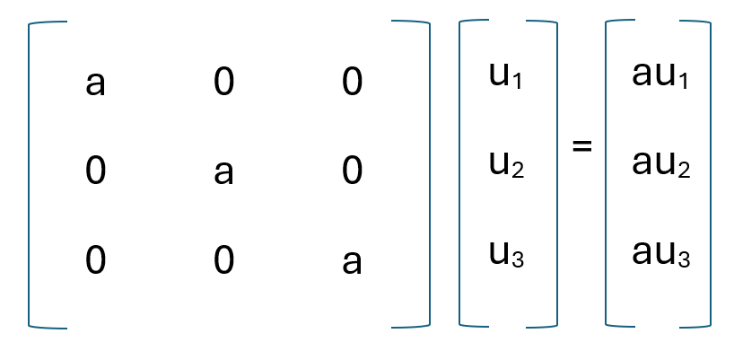
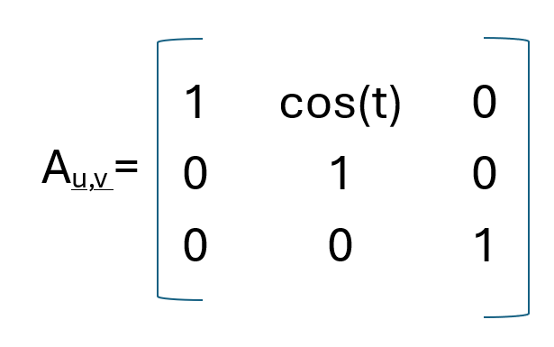
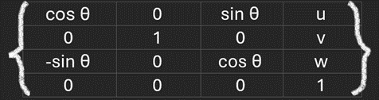
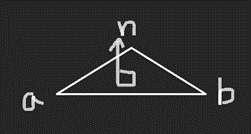
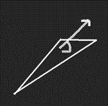
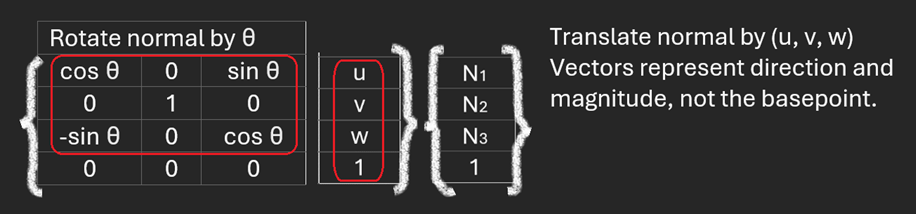
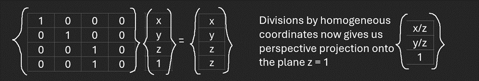

# Lecture 05: Spacial Transformations (CMU 15-462/662)

## Review: Linear Maps
Geometrically: maps lines to lines and preserves origin.

Algebraically: preserves vector space operations (addition and scaling).

## Linear Transformations
- Cheap to apply
- Easy to solve for (linear systems)
- Composition of linear transformations is linear:
    - product of many matrices is a single matrix.
    - uniform representation of transforms.
    - simplifies graphics algorithms, systems (GPUs, APIs).

## How to determine transformation?
By invariants it preserves.
transformation  invariants
linear          straight lines/origin
translation     difference between pair of points
scaling         lines through origin/vector directions
rotation        origin/distance between points/orientation

## 2D Rotations

## 3D Rotations

## Rotations - Transpose as Inverse
QTQ = *I*

Does every matrix QTQ = *I* represent a rotation?

No. E.g. 

QTQ = *I* holds true, but Q is a reflection matrix.

## Orthogonal Transformations
Transformations that preserve distances and origin.

QTQ = *I*

For rotations, the determinant of Q is positive, det(Q) > 0.

For reflections, the determinant of Q is negative, det(Q) < 0.

## Scaling
Preserves direction while changing magnitude.

If a is negative, the image will reflect as long as there are odd axes, on the other hand, for even axes rotation will take place instead of reflection.

## Non Uniform Scaling
To scale a vector non uniformly, we follow the steps mentioned below:
1. Rotate the image to a new axes (R)
2. Apply diagonal scaling (D)
3. Rotate back to original axes (RT)

Spectral Theorem

A=AT

Aei = $\Lambda$ ei

orthonormal eigenvectors and read eigenvalues

## Shear
A shear displaces each point x in a direction u according to its distance along fixed vector u.

f**u**,**v**(**x**) = **x** + <**v**, **x**>**u**

The further **x** is in the direction of **v**, the more we displace it in the direction of **u**.

Is it a linear transform?

Yes.

A**u**,**v** = *I* + **uv**T

E.g. 

**u** = (cos(t), 0, 0)

**v** = (0, 1, 0)

## Composite Transformations
To apply a series of transformations, the transformations must be applied from last to first. E.g. if transformations A B and C need to be applied, they will be applied as CBA.

## Decomposition of Linear Transformation
There is no unique way to decompose linear transformations. Some of the ways are:
- singular value (good for sinal processing)
- LU factorization (good for solving linear systems)
- polar decomposition(good for  spacial transformations)

# CHECK FROM HERE ONWARDS

Polar and singular value Decomposition.

$A=Q P$ - nonnegative, non uniform scaling.

rotation/ufflection since $P$ is symmetric, spectial decamposition applied

$$
\begin{aligned}
& P=V D V^{\top} \quad(V \text { irthoganal, } D \text { diagonal }) . \\
& A=Q V D V^{\top} \\
& A=U D V^{\top} \\
& \text { rotation where } U=Q V . \\
& \text { axesaligned } \\
& \text { scatation }
\end{aligned}
$$

Interpolating Transformations - Linear

take linear combination of two matices weighted by connent time
$t \in[0,1]$ $A(t)=(1-t) A_{0}+t A_{1}-$ hits right end painls

Intupolating Tranafomations - Polar. - looks awful in between

Separatily intuplolate components of polar decomposition
$A_{0}=Q_{0} P_{0}, \quad A_{1}=Q_{1} P_{1}$

$P(t)=(1-t) P_{0}+t P_{1} \quad \widetilde{Q}(t)=(1-t) Q_{0}+t Q$.

always gaing to be tre definite matrix $\quad \tilde{Q}(t)=Q(t) \times(t)$
Translation in Homogeneous Coordinates.

If we apply translation in 2D, it is seem as shear in 3D. And shear is a linear transfomation

$p=\left(p_{1}, p_{2}\right)$ tianslated by a vector $u=\left(u_{1}, u_{2}\right)$ to get $\left(p_{1}+u, p_{2}+u\right)$

homogencous coordinates bocome $\hat{p}=\left(c p_{1}, c p_{2}, c\right)$

become $\hat{p}^{\prime}=\left(c p_{1}+c u_{1}, c p_{2}+c u_{2}, c\right)=p_{2}$

shifting $\hat{p}$ by an amount cu - proportional to distance $c$

along third axis - a shear.

Using homogencous coordinates allows representing affine

Transformation in 2D as a linear transfomation un 3D

Homogencous Translation - Shear Representation
shear:

$f \underline{u}, \underline{v}(\underline{x})=\underline{x}+\langle\underline{v}, \underline{x}\rangle \underline{u}$

matrix form:

$f \underline{u}, \underline{v}(\underline{x})=\left(I+\underline{u} \underline{v}^{\top}\right) \underline{x}$

$v=(0,0,1)$ and we get the matiox

$\left[\begin{array}{ccc}1 & 0 & u_{1} \\ 0 & 1 & u_{2} \\ 0 & 0 & 1\end{array}\right]\left[\begin{array}{c}c p_{1} \\ c p_{2} \\ c\end{array}\right]=\left[\begin{array}{c}c p_{1}+c u_{1} \\ c p_{2}+c u_{2} \\ c\end{array}\right] \xrightarrow{1 / c}\left[\begin{array}{c}p_{1}+u_{1} \\ p_{2}+u_{2}\end{array}\right]$
Other transformations are unaffected by the addition of a new dimesion.

3D Transformations in Homogeneous Coordinates.

Points vs. Vectors

Consider a triangle with vertices $a, b, c$ in $\mathbb{R}^{3}$

norm rector $n \in \mathbb{R}^{3}$

tansformation matrix: $\qquad$

Points vs. Vectors 
Consider a triangle with vertices a, b, c in R3 
                                                   norm vector n ∊ R3
Transformation matrix: 
  
  
  

The normal is not orthogonal to the triangle! 

When we rotate / translate a triangle, its normal should just rotate. 

Solution: set homogeneous coordinate to zero. 
Translation gets ignored; normal is orthogonal to △. 
 
Points vs. Vectors in Homogeneous Coordinates 
Point – non zero homogeneous coordinate (c = 1)
Vector – zero homogeneous coordinate (c = 0)

How can we divide by zero?
Think of vectors as “points at infinity” (“ideal points”)

#### Perspective Projection in Homogeneous Coordinates
(x, y, z)    ->     (x/z, y/z)

 
 

## Screen Transformation 
Turn these coordinates into pixel coordinates.
y is flipped on the screen – goes from top to bottom.

#### Scene Graph
Helps organise transformations.
If we have a cube creature, it will be difficult to directly specify each transformation.
Each part of the body is linked, so it is better to build up transformations of “lower” parts from transitions of “upper” parts.

--

e.g A1A0 applied to left upper leg and
       A2A1A0 applied to left lower leg.
Keep transformations on stack to reduce redundant multiplication.

Order of Transformation matters.

