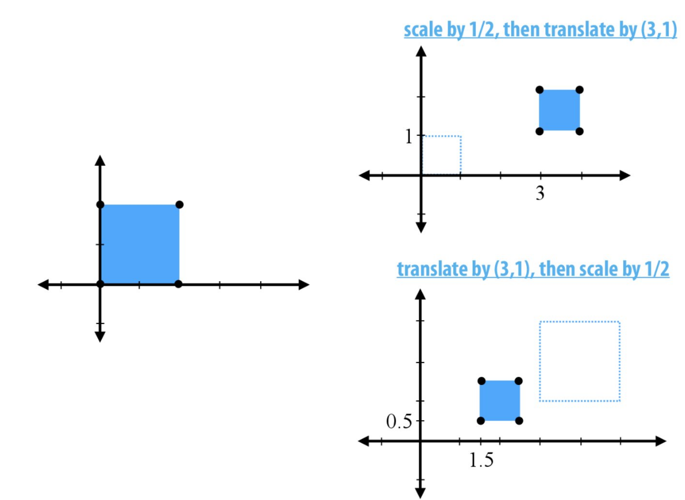

# Lecture 05: Spatial Transformations (CMU 15-462/662)

## Review: Linear Maps
Geometrically: maps lines to lines and preserves origin.

Algebraically: preserves vector space operations (addition and scaling).

## Linear Transformations
- Cheap to apply
- Easy to solve for (linear systems)
- Composition of linear transformations is linear:
    - product of many matrices is a single matrix.
    - uniform representation of transforms.
    - simplifies graphics algorithms, systems (GPUs, APIs).

## How to determine transformation?
By invariants it preserves.
transformation  invariants
linear          straight lines/origin
translation     difference between pair of points
scaling         lines through origin/vector directions
rotation        origin/distance between points/orientation

## 2D Rotations

## 3D Rotations

## Rotations - Transpose as Inverse
QTQ = *I*

Does every matrix QTQ = *I* represent a rotation?

No. E.g. 

QTQ = *I* holds true, but Q is a reflection matrix.

## Orthogonal Transformations
Transformations that preserve distances and origin.

QTQ = *I*

For rotations, the determinant of Q is positive, det(Q) > 0.

For reflections, the determinant of Q is negative, det(Q) < 0.

## Scaling
Preserves direction while changing magnitude.

If a is negative, the image will reflect as long as there are odd axes, on the other hand, for even axes rotation will take place instead of reflection.

## Non Uniform Scaling
To scale a vector non uniformly, we follow the steps mentioned below:
1. Rotate the image to a new axes (R)
2. Apply diagonal scaling (D)
3. Rotate back to original axes (RT)

Spectral Theorem

A=AT

Aei = $\Lambda$ ei

orthonormal eigenvectors and read eigenvalues

## Shear
A shear displaces each point x in a direction u according to its distance along fixed vector **u**.

f**u**,**v**(**x**) = **x** + <**v**, **x**>**u**

The further **x** is in the direction of **v**, the more we displace it in the direction of **u**.

Is it a linear transform?

Yes.

A**u**,**v** = *I* + **uv**T

E.g. 

**u** = (cos(t), 0, 0)

**v** = (0, 1, 0)

## Composite Transformations
To apply a series of transformations, the transformations must be applied from last to first. E.g. if transformations A B and C need to be applied, they will be applied as CBA.

## Decomposition of Linear Transformation
There is no unique way to decompose linear transformations. Some of the ways are:
- singular value (good for signal processing)
- LU factorization (good for solving linear systems)
- polar decomposition(good for  spatial transformations)

# CHECK FROM HERE ONWARDS

## Polar and Singular Value Decomposition

$A=Q P$ - nonnegative, non uniform scaling (positive – semidefinite matrix)

Q - rotation/reflection matrix 

Since $P$ is symmetric, spatial decomposition applied

$$
\begin{aligned}
& P=V D V^{\top} \quad(V \text { orthogonal, } D \text { diagonal }) . \\
& A=Q V D V^{\top} \\
& A=U D V^{\top} \\
& \text { where } U=Q V . \\
& U - \text { rotation } \\
& D - \text { axes aligned scaling } \\
& V^{\top} \text { rotation }
\end{aligned}
$$

## Interpolating Transformations - Linear

Take linear combination of two matrices weighted by current time

$t \in[0,1]$ 

$A(t)=(1-t) A_{0}+t A_{1}$

The interpolation hits right end points but looks awful in between.

## Interpolating Transformations - Polar

In this method, we separately interpolate components of polar decomposition.

$A_{0}=Q_{0} P_{0}, \quad A_{1}=Q_{1} P_{1}$

$P(t)=(1-t) P_{0}+t P_{1}$

Always going to be +ve definite matrix 

$\widetilde{Q}(t)=(1-t) Q_{0}+t Q$.

$\tilde{Q}(t)=Q(t) \times(t)$

$A(t) = Q(t)P(t)$

## Translations
$f \underline{u}(\underline{x}) = \underline{x} + \underline{u}$ 

Is the translation linear?

#### Additive Property  & Homogenity
$$
\begin{array}{ll}
f_u(x+y)=\underline{x}+\underline{y}+\underline{u} & f_n(a x)=a \underline{x}+u \\
f_1 s(x)+f_{\underline{u}}(y)=\underline{x}+\underline{y}+2 \underline{u} & a f_x(x)=a \underline{x}+a \underline{u}
\end{array}
$$

Translation is not linear, it is affine. It does not preserve origin, instead, it makes the origin $u$.

## Composition of Transformations

- For the composition of other transforms we would just keep track of the matrices.

- For the composition of translation we also have to key track of the vectors.

Solution: ENTER THE $4^{\text {th }}$ DIMENSION

## Homogeneous Coordinates (2D)
Consider $p=(x, y)$ and the plane $z=1$ in $3D$.

$\hat{p}=(a, b, c)$ where $(a / c, b / c)$ are homogeneous coordinates
e.g. $(x, y, 1)$

In general: $(c x, c y, c)$ for $c \neq 0$

Two points $\hat{p}, \hat{q} \in \mathbb{R}^3 \backslash\{0\}$ describe same point in $2 D$ (which would be a line in 3D) if $\hat{\rho}=\lambda \hat{q}$ for some $\lambda \neq 0$.

## Translation in Homogeneous Coordinates

If we apply translation in 2D, it is seem as shear in 3D, and shear is a linear transformation

$p=\left(p_{1}, p_{2}\right)$ translated by a vector $u=\left(u_{1}, u_{2}\right)$ to get $\left(p_{1}+u, p_{2}+u\right)$

Homogenous coordinates $\hat{p}=\left(c p_{1}, c p_{2}, c\right)$

Become $\hat{p}^{\prime}=\left(c p_{1}+c u_{1}, c p_{2}+c u_{2}, c\right)$

Shifting $\hat{p}$ by an amount $c\underline{u}$ which is proportional to distance $c$ along third axis, resulting in a shear.

Using homogenous coordinates allows representing affine transformation in 2D as a linear transformation in 3D.

## Homogenous Translation - Shear Representation
shear:

$f \underline{u}, \underline{v}(\underline{x})=\underline{x}+\langle\underline{v}, \underline{x}\rangle \underline{u}$

matrix form:

$f \underline{u}, \underline{v}(\underline{x})=\left(I+\underline{u} \underline{v}^{\top}\right) \underline{x}$

$v=(0,0,1)$ and we get the matrix

$\left[\begin{array}{ccc}1 & 0 & u_{1} \\ 0 & 1 & u_{2} \\ 0 & 0 & 1\end{array}\right]\left[\begin{array}{c}c p_{1} \\ c p_{2} \\ c\end{array}\right]=\left[\begin{array}{c}c p_{1}+c u_{1} \\ c p_{2}+c u_{2} \\ c\end{array}\right] \xrightarrow{1 / c}\left[\begin{array}{c}p_{1}+u_{1} \\ p_{2}+u_{2}\end{array}\right]$

Other transformations are unaffected by the addition of a new dimension.

## 3D Transformations in Homogeneous Coordinates.

Just append a "homogencous coordinate".

Matrix representations of linear transformations just get an additional identity row/column. 

Translation is shear 

Point in 3D , rotate $(x, y, z)$ about $\theta$, shear $(x, y)$ by $z$ in $(x) d x$ $\left[\begin{array}{l}x \\ y \\ z \\ 1\end{array}\right]\left
[\begin{array}{cccc}\cos \theta & 0 & \sin \theta & 0 \\ 0 & 1 & 0 & 0 \\ -\sin \theta & 0 & \cos \theta & 0 \\ 0 & 0 & 0 & 1\end{array}\right]
\left[\begin{array}{cccc}1 & 0 & s & 0 \\ 0 & 1 & t & 0 \\ 0 & 0 & 1 & 0 \\ 0 & 0 & 0 & 1\end{array}\right]$ 

scale $x, y, z$ by $a, b, c$, translate $(x, y, z)$ by $(u, v, w)$
$$
\left[\begin{array}{cccc}
a & 0 & 0 & 0 \\
0 & b & 0 & 0 \\
0 & 0 & c & 0 \\
0 & 0 & 0 & 1
\end{array}\right]\left[\begin{array}{cccc}
1 & 0 & 0 & u \\
0 & 1 & 0 & v \\
0 & 0 & 1 & \omega \\
0 & 0 & 0 & 1
\end{array}\right]
$$

## Points vs. Vectors

Consider a triangle with vertices $a, b, c$ in $\mathbb{R}^3$ norm vector $n \in \mathbb{R}^s$

Transformation matrix:
$$
\left[\begin{array}{cccc}
\cos \theta & 0 & \sin \theta & u \\
0 & 1 & 0 & v \\
-\sin \theta & 0 & \cos \theta & \omega \\
0 & 0 & 0 & 1
\end{array}\right]
$$

The normal is not orthogonal to the triangle!

Consider a triangle with vertices $a, b, c$ in $\mathbb{R}^{3}$

The normal is not orthogonal to the triangle! 

When we rotate / translate a triangle, its normal should just rotate. 

Solution: set homogeneous coordinate to zero. 
Translation gets ignored; normal is orthogonal to △. 

## Points vs. Vectors in Homogeneous Coordinates 
- Point – non zero homogeneous coordinate (c = 1)
- Vector – zero homogeneous coordinate (c = 0)

How can we divide by zero?
Think of vectors as “points at infinity” (“ideal points”)

## Perspective Projection in Homogeneous Coordinates
(x, y, z)    ->     (x/z, y/z)

 
 

## Screen Transformation 
Turn these coordinates into pixel coordinates.
y is flipped on the screen – goes from top to bottom.

#### Scene Graph
Helps organise transformations.
If we have a cube creature, it will be difficult to directly specify each transformation.
Each part of the body is linked, so it is better to build up transformations of “lower” parts from transitions of “upper” parts.

--

e.g. A1A0 applied to left upper leg and
       A2A1A0 applied to left lower leg.
Keep transformations on stack to reduce redundant multiplication.

## Order of Transformation matters

## Drawing a Cube Creature
1.	Use scene graph to apply 3D transformations to several copies of the cube.
2.	Apply 3D transformation to position camera.
3.	Perspective Projection.
4.	Convert to image coordinates (and rasterize).

