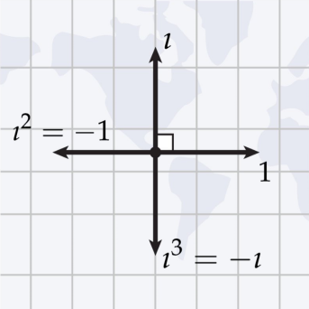
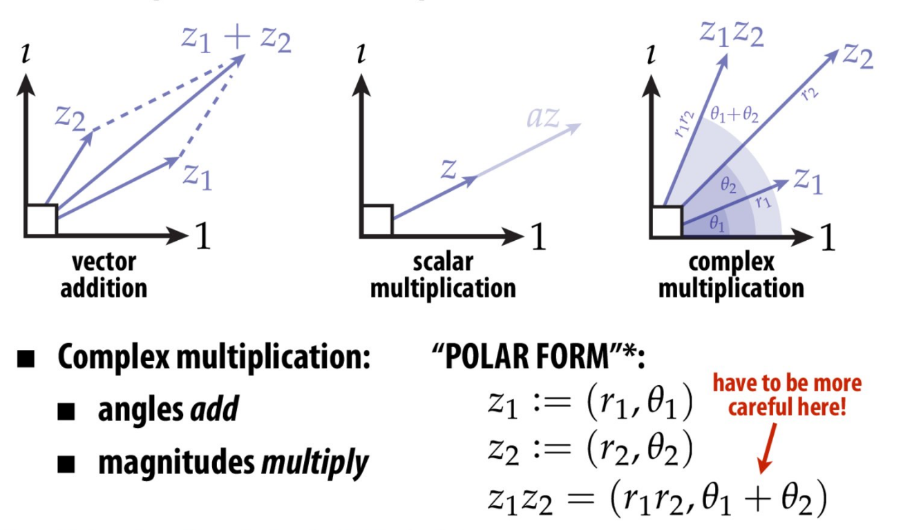
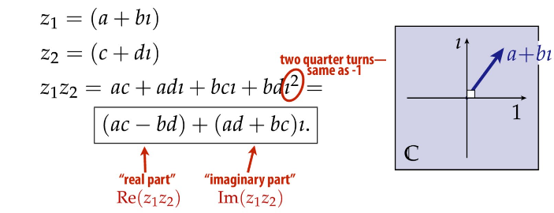
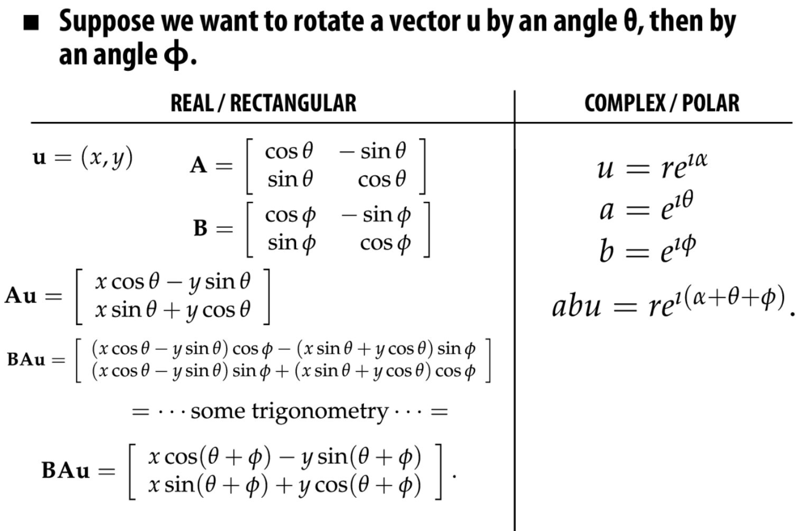
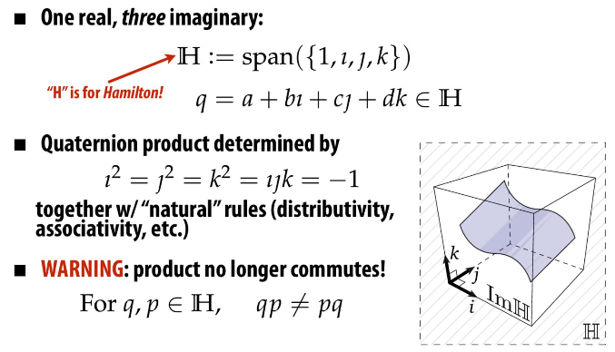
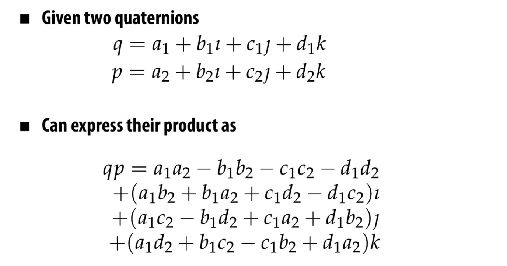
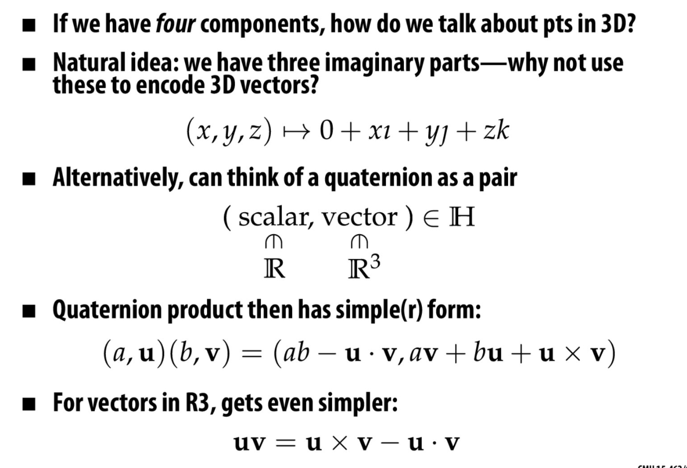
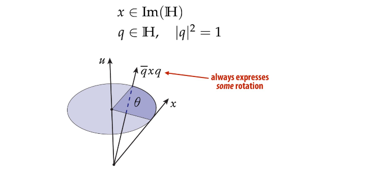
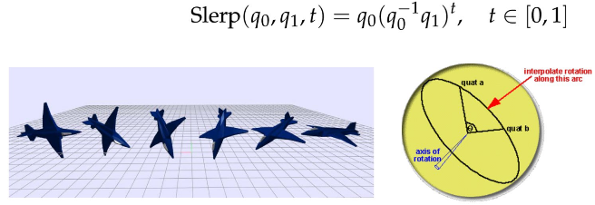
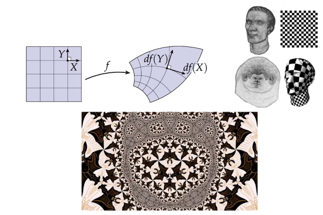

# Rotations in 3D
How would you define a rotation? Something that has everything shifted about a certain point perhaps? And that shifting is not horizontal, or vertical, it is in a circular manner around a certain point. So these leads to two main ideas:
•	When we are dealing with rotation, we see that the rotation is about the origin, otherwise the transformation shows as a rotation with a certain translation. 
•	No reflection must take place. E.g. if the object has any text on it, it is still readable after the transformation.

Can you get all possible rotations of a 3D object by using X, Y and Z coordinates?

Let’s see if the order of rotations matter.
## 2D
40 degree + 20 degree = 20 degree + 40 degree
 
No, it does not matter.
 
 
## Expressing Rotations In 3D
Euler angles are very conceptually easy to understand, but result in a big problem which is the gimbal lock.
### Gimbal Lock
During rotation using Euler angles, there comes a point where changing the rotation parameters does not change anything, only Theta X and Theta Z change but not Theta Y, and the rotation goes into a lock state, not allowing the object to be rotated. 
Complex analysis. 
Let's first discuss the motivation behind it. 
### Complex representation of rotations
We use complex numbers from a geometric point of view. Encode geometric transformations in two dimensions and it's easier to think about those, and thus those are easier to code. There is a slight reduction in computational cost/bandwidth/storage and can result in deeper or more novel solutions to problems. For example, surface parameterization and texture mapping. Thus, complex numbers are strictly better replacement for 2D numbers. 
## Imaginary Unit - Geometric Description
Imaginary unit is just a quarter turn in the clockwise direction. Complex numbers are two-dimensional vectors, so instead of e1 and e2, we use 1 and i. 

## Complex Arithmetic
This includes the regular arithmetic, for example, the vector addition and scalar multiplication are the same as before, but the complex multiplication is different, in which the angles add and the magnitudes multiply. 

## Complex Product - Rectangular Form

## Complex Product - Polar Form
ei  pi + 1 = 0
Specialization of Euler's formula:
ei  theta = cos theta + sin theta (a function that takes point Theta on the unit circle)
ei  pi  is S theta from before.
Basically, this means point on the circle, theta away from X axis
### Implement complex product: 
{ INSERT EQUATIONS }
Exponent takes care that the angles wrap around.

## 2D Rotations: Matrices versus Complex
Objective rotate the vector u by theta then by phi. 
Real/Rectangular: 

## Quaternions in Coordinates
In order to do 3D rotations so that they mimic the way we do 2D rotations, we need the fourth dimension, i.e. 4 coordinates.

This is Quaternion multiplication, along with the ordinary rules, BUT one very important thing to note: product no longer commutes.

## Quaternion Product in Components

## Quaternions – Scalar + Vector Form
Four components are used to show points in 3D.

## 3D Transformation via Quaternions
What is the main use of quaternions in graphics?

## Interpolating Rotations
To interpolate between two rotations, we use quaternions: “SLERP” (Spherical Linear Interpolation)

## Generating Coordinates For Texture Maps
Complex numbers are natural language for angle preserving (“conformal”) maps. Preserving angles well tuned to human perception.

