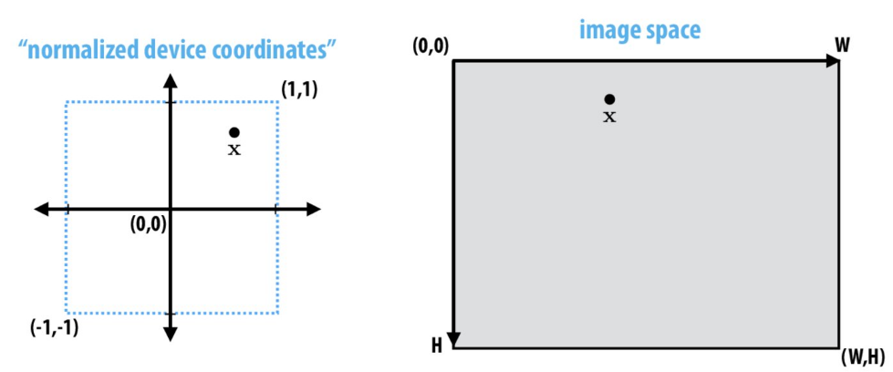

# Lecture 07: Perspective Projection and Texture Mapping (CMU 15-462/662)

Perspective projection has two main ideas:
1. Parallel lines converge at a certain point
2. Objects appear smaller further away
To achieve these, we make use of a simple camera transformation.

Simple Camera Transformation 
Consider a camera at (4, 2, 0) looking down the x axis

What spatial transformation puts in the object in a coordinate system where the camera is at the origin, looking down the z axis?
1.	Translating object vertex position (-4, -2, 0) yields position relative to camera.
2.	Rotation about y by pi/2 gives position of object in raw coordinate system where camera’s view direction aligns with -z axis (neg)

What transformation places in the object in a coordinate system where the camera is at the origin and the camera vs looking in a different direction?

### Construct vectors u, v, orthogonal direction? 
To w, e.g. pick an up vector v, let u =  w \times v (orthogonal)

R maps x-axis to u, y axis to v, z axis to -w

Build corresponding rotation matrix

### View frustum

Top, bottom, left, right planes correspond to four sides of the image.
Near/far planes correspond to the closest/farthest thing we want to draw. All the other things are omitted from the drawing.

## Clipping
Clipping is the process of eliminating triangles that are not part of the frustum.

#### Why do we need to do that?
- We do not want to waste time rasterizing primitives (i.e. triangles) that cannot be seen.
- “fine granularity” – discarding individual fragments is expensive.
- “Coarse granularity” – makes more sense to discard whole primitives
-	Still need to deal with primitives that are clipped:

#### So what do we do when a triangle is clipped?
Divide the triangles into sub-triangles.

#### Why sub-triangles? 
GPUs are made to render triangles.

## Near/Far Clipping
#### Why do we need it?
Sometimes when something is too close, it tends to go in all directions, +ve and -ve z axis, etc. Hence, it gets difficult to render it, and it is better to clip those.

### What if you want to draw many primitives on the screen?

This introduces the idea of depth-buffering, used for this occlusion. You will need to keep track of the closest depth seen so far if you try to draw anything further than the closest depth so far, you toss that out.

Depth is stored in floating points, so if the nearest distance is taken as $10^-1$ and farthest distance is taken to be $10^3$, this will result in a clean drawing. On the other hand, if the nearest distance is taken as $10^-5$ and farthest distance is taken to be $10^5$.

## Mapping Frustrum to Unit Cube

Why do we do this?
It makes clipping easier
-	Discard points outside range [-1, 1]
-	Need to think about partially clipped triangles

Let's go a step further and wonder, is it possible to express this mapping as a matrix? If yes, how?

We may consruct a matrix A, which transforms coordinates from x to y, and solve Axi = yi for unknown entries of A

In this case we are not solving for x like we usually do when we have the matric Ax = b, instead we are solving for A, where A is the linear transformation matrix.

### Matrix for Perspective Transform

Basic perspective projection matrix

Copy z into homogeneous coordinates (we need 4th dimension to be 1).

## Screen Transformation
Transformation from 20 viewing plane to pixel coordinates
1.	Reflect about x axis
2.	Translate by (1, 1)
3.	Scale by (W/2, H/2)

How to draw nice primitives?
1.	Coverage
2.	Sampling colour – interpolate the colour values at the vertices

### Linear Interpolation in 1D.
How to construct a function that connects dots (i.e. samples) via straight lines?

The diagram represents a linear interpolation in the shape of an affine function of t.

### How to do something like this in 2D?

This time, to connect the dots, you will have to fit a plane
How to do that?
You would want to fit a linear (or affine) function to the three values: $\hat{f}(x, y) = ax + by + c$.
To find the affine function, we just need to find $a$, $b$, and $c$.
(find coefficients such that they match the sample values at the simple points).

This gives three linear equations with these unknowns, and the solution through regular linear algebra techniques turns out to be cumbersome. 

### How to make the process easier?
For this, we refer back to the 1D linear interpolation technique.

Using this idea, we may approach 2D interpolations.
-	We construct analogous functions for a triangle.
-	For a given point x, measure the distance to each edge, then divide by the height of the triangle.

Does this give the same result as the one we got by solving the matrix?

## Barycentric Coordinates
Values of the three functions $\phi_i(x), \phi_j(x), \phi_k(x)$ for a given point are called barycentric coordinates.
Can be used to interpolate between anything, e.g. colour, texture, etc.

$colour(x) = colour(x_i)\phi_i(x) + colour(x_j)\phi_j(x) + colour(x_k)\phi_k(x)$

#### The same three values fall out of half-plane tests used for triangle rasterization. Why?

You do a dot product with the normal of that hald plane, giving the distance along that normal. You do a dot product minus the offset, giving you the distance from an edge, e.i. the quantity needed to evaluate barycentric coordinates distance divided by height, so we are getting the barycentric coordinates for free when rasterising the triangles.

These are perfect for interpolation.

## Perspective Incorrect Interpolation
Due to the perspective projection (homogeneous divide), barycentric interpolation of values on a triangle with different depths is not an affine function of screen XY coordinates.

If you have already projected triangle vertices on 2D plane, and try interpolating values at corners of the triangle using the barycentric coordinates, you get from the 2D triangle, you are not cloning the right interpolation of values on the 3D triangle.

You need to interpolate attribute values linearly in 3D object space, not the image space.

## Perspective Correct Interpolation
Goal: interpolate some attribute values $\phi$ at vertices

Basic recipe:
-	Compute depth z at each vertex .
-	Evaluate $z = 1 / x$ and $p = \phi/z$ at each vertex.
-	Interpolate z and P using standard (2D) barycentric coordinates.
-	At each fragment, divide interpolated P by interpolated Z to get final value.

### Texture Mapping
The idea behind texture mapping is wrapping 2D surfaces onto 3D objects (like wrapping a box with gift wrap).
### Normal and Displacement Mapping
Normal – map the texture onto the object as if covering it. It results in an unrealistic image.

Displacement – dice up surface geometry into tiny triangles and offset positions to texture values. Renders a more realistic image.

Displacement mapping also helps in rendering precomputed lighting and shadows.

We not only care for where the light hits the object, but also where it bounces upon hitting, in case it is reflected at some other part of the same object or reflects onto a different object.

### Texture Coordinates
#### How to map textures onto objects using coordinates?
Texture Coordinates map a texture from surface coordinates to points in the texture domain, this is often done by linearly interpolating texture coordinates at triangle vertices.

## Texture Sampling 101
The basic algorithm for texture mapping was shown before
-	For each pixel in the rasterized image.
-	Interpolate (u, v) coordinates across triangle
-	Sample (evaluate) texture at interpolated (u, v)
-	Set colour of fragment to sample textured value

The issue: things are not so straightforward, and the main problem encountered with this approach is aliasing.

### Recall: Aliasing
Under sampling a high frequency signal can result in aliasing.

## Visualising Texture Samples
The transformation from 2D to 3D is not as plain and simple, and the transformation results in pixels in the screen space will correspond to regions of varying size and location in texture. 

## Magnification vs Minification

A way to break down patterns is to decide if we are doing magnification or minification.

Magnification in the easier of the two, and the idea so that the camera is very close to the scene object and a single screen pixel maps to a tiny region of the texture. So for this you can just interpolate value at screen pixel centre.

Minification poses some difficulties, as it catus to the idea of the same object being very far away, as that would result in it mapping to a large region of the texture.

Hence, we need to compute the average texture value over pixel to avoid it.

But how to do that?

## Bilinear Interpolation (Magnification)
How can we look up a texture value at a non-integer location (u, v)?

## Prefiltering Texture (Minification)
The main purpose is to remove jagged lines/edges.

Reason for texture aliasing: single pixel on screen covers many pixels of the texture, which means under sampling takes place, resulting in aliasing.

If we have a pixel (either very big or very small), that we want to grab texture values from, choosing the colour from the centre would be the naive thing to do and this would result in incorrect remaining as a lot of different colours are covered by that pixel.

The better approach would be to average the colours inside that pixel.

## MIP map (L. Williams 83)
The idea as to store the images in different resolutions, starting from the highest power of 2 to the lowest power. 

-	Rough idea is to store prefiltered image at every possible scale.
-	Texels at higher levels store average of texture over a region of down sampled texture space.
-	Later: look up a single pixel from MIP map of appropriate size/ resolution

The layout proposed by William:

Q. What’s the storage overhead of a MIP map? 
It takes 1/3 of the space of the original image, hence, there is no excuse to not use MIP map.

### Computing MIP map level

To get a better approximation, we grab pixels from different levels of the MIP map hierarchy.

Which pixel should sample from a coarser MIP map level: blue or red?

Blue – very close together – can be grabbed directly from the original (HDR) image.

Red – far apart, require averaging.

#### Why are we taking logarithm?
For each level, we divide the MIP map size by 2. To know which level we are on, we need to take log base 2.

Rendering the closer objects as high resolution and farther objects as low resolution required level interpolation otherwise the level jumps will be very abrupt. Hence, we must use a continuous MIP map instead of clamping the MIP map to the closest integer.

**Problem: we only computed a fix number of levels, how to interpolate between those?**

## Trilinear Filtering
Weighted average along v

Weighted average along u

Weighted average along w

## MIP map lookup
MIP map interpolation works in the same way, but instead of interpolating from a 3D grid, we will interpolate from two MIP map levels, closest to $d \in \R$. It does not matter that the two levels have different resolutions. For that, we:
1.	Perform bilinear interpolation independently in each level.
2.	Then we interpolate between two bilinear values

## Texture Sampling Pipeline
1. Compute u and v from screen sample $(x, y)$ via barycentric interpolation.
2. Approximate $du/dx, du/dy, dv/dx, dv/dy$ by taking differences of screen-adjacent samples
3. Compute MIP map level d
4. Convert normalized [0,1] texture coordinate $(u, v)$ to pixel locations $(U, V) \in [W, H]$ in texture image
5. Determine addresses of texels needed for filter (e.g., eight neighbours for trilinear)
6. Load texels into local registers
7. Perform tri-linear interpolation according to $(U, V, d)$
8. Do more work for anisotropic filtering

Takeaway: high quality texturing requires far more work than just looking up a pixel in an image. Each sample demands significant arithmetic and bandwidth, hence, GPUs have dedicated, fixed function hardware to perform texture sampling operations.
