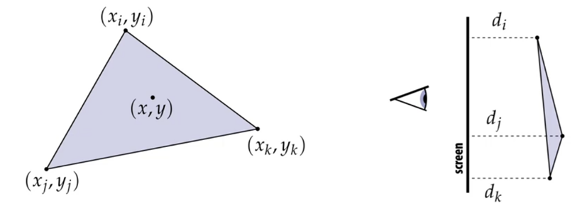

# Lecture 08: Depth and Transparency (CMU 15-462/662)

Things we know:
1.	How to position objects in the world using 3D transformations
2.	How to project those objects onto the screen using perspective projection
3.	How to sample triangle coverage using rasterization
4.	Interpolating vertex attributes using Barycentric Coordinates
5.	How to sample texture maps using filtering and MIP mapping

What we do not know, and which is also the last part of the process, is: how to put samples into the frame buffer using depth and alpha.

To start with the last part of the pipeline, it is necessary to look at occlusion.

First, we will observe which triangle is visible at a point. Then, we will look at the transparency of that triangle and render it accordingly.

## Sampling Depth
Assume we have a triangle given by:
-	The projected 2D coordinates (xi, yi) of each vertex
-	The “depth” d of each vertex (i.e. distance from the viewer)

### How do we compute the depth d at a given sample (x, y)?
We interpolate it using barycentric coordinates, just like any attribute that varies linearly over the triangle.

Now we need to figure out which triangle should show up at each sample. We want the triangle with the smallest depth to be drawn at that sample point. In rasterization, one triangle is processed at a time, we do not have to keep a list of the triangles. Although that is convenient from storage point of view, but how do we figure out which one to show and which one should get occluded?

The simple solution is the depth buffer. Instead of just keeping a reference to the colour, a reference to the depth is also kept.

How to use the depth buffer to render triangles based on their opacity?
### Simple Case – Rendering Three Opaque Triangles
Image to render:

Process:

### Does the order in which these triangles are processed matter?
No it does not, as the rendering of the triangles are based on their depths, hence, regardless of the order in which the triangles are processed, the result remains the same. This can further be seen through the following pseudocode:

### Does Depth Buffering cater to Intersecting Triangles?
We looked at triangles on top of each other and saw how the depths allow us to tell which is on top of the other, but can depth buffering ensure the intersection of triangles is also seen in the result? Yes, the occlusion test is based on the depth of triangles *at a given sample point*. The relative depth of triangles may be different at different samples. We are considering the depth at a sample by sample basis instead of a triangle by triangle basis. 

### Does Depth Buffer work with Super Sampling?
Instead of having regular samples, we will have more samples due to super sampling, and on each sample of the super sample, the depth test will take place, hence preserving the required behavior. 

Thus, we see that depth buffering takes constant space and constant time, it is not dependent on overlapping triangles, nor is it allowed to modify any computed values, if the test has passed, it will move on, if it has failed, it will still move on. 

Depth rasterization is unaffected by the shape being used as a primitive as it has a sample by sample approach, the shape can also be squares or circles, but the result will be the same.

## How will semi transparent surfaces work?
First, we need to deal those as how are they stacking up over each other, instead of focusing on depth.

We will introduce a new variable alpha, which has a value 0 <= alpha <= 1, which describes the opacity of an object (1 being completely opaque and 0 being completely transparent).

You may have an alpha value for each pixel in an image. This is useful when you attempt to composite one image on top of the other. The issue of fringing comes along when dealing with pixels describing fine objects, like hair, the alpha values of which are not treated as finely as they should be, and result in a dark outline around the object. This is called fringing.

The way to overcome this issue is the over operator.
## Over Operator
First, it must be realised that the order of the shapes is important and it is not commutative, because a shape A over a shape B is not the same as B over A.

### Non-Premultiplied Alpha

### Premultiplied Alpha
In premultiplied alpha, you first multiply a colour by alpha, then you composite like this:

C is telling us that B is going over A, so we will show you B, which has already been adjusted by alpha. We will also show you A’, but modulated by how much of B it lets through.

Notice premultiplied alpha composites alpha just like how it composites rgb.

(Non-premultiplied alpha composites alpha differently than rgb)

To get the final colour, all the components must be divided by the alpha value used to premultiply. 

Does this remind you of anything? It’s an example of using homogeneous coordinates. We introduce a fourth dimension, perform the required arithmetic, then revert to the three dimensions.

### Difference between premultiplied and without premultiplied:

### Why do we get the “green fringe” when we don’t premultiply?

During the interpolating process, when super sampling takes place, the colours at the pixels are averaged, thus resulting in a blue green colour, instead of having just blue as the colour. During the premultiplication process, the interpolation takes place between the blue and a black background, which produces cleaner results.

### Composing Images With Multiple Opacities

In the non premultiplied process, the transparency would be with respect to a black background, while in the premultiplied process, the process is dependent on the transparency of the objects instead. Premultiplied alpha does a much better job at separating out the colours and blending opacities.

### Strategy for drawing semi-transparent primitives

What assumption needs to be made for this implementation?

The triangles must be rendered from back to front, hence, the order is very important. The function “over” requires this.

One idea is to store an additional buffer called the alpha buffer but it would have to store multiple values per pixel, making it more expensive.

The best solution to this problem would be to have order independent transparency. Peeling is one technique, while raytracing is the most effective one.

### What if we have a mixture of opaque and transparent triangles?
Step 1

Since opaque triangles do not need to be rendered in order and are just based on depth, we may conduct the depth test and render those in any order, using depth-buffer occlusion.
Step 2

Non opaque triangles need to be rendered based on their order, i.e. back to front, so the depth buffer update should be disabled, semi transparent surfaces will be rendered in a back to front order, if the depth test is passed, the triangle should be composited over the contents of the colour buffer that that sample. (The reason of specifying that the depth test should be passed is that there is no reason to render a primitive that is hidden behind other primitives.

## Goal: Turn Inputs into an Image
### Summary
We looked into the 8 steps that make up the rasterization pipeline, let us summarize those.

Initially we just have our inputs, which include positions in the x, y and z directions, texture coordinates, object to camera space transform, perspective projection transform and the size of the output image. Using this input, we need to generate an output.

Step 1: Transform triangle vertices into camera space
 

Step 2: Apply perspective projection transform to transform triangle vertices into normalized coordinate space

Step 3: Clipping
-	Remove triangles outside of the unit cube (culling)
-	Clip triangles that extend beyond the unit cube (might need to generate new triangles for this)

Step 4: Transform to Screen Coordinates
Perform homogeneous divide, transform vertex xy positions from normalized coordinates into screen coordinates (based on screen w, h).

Step 5: Setup Triangle (Triangle Processing)
Before rasterizing the triangle, we can compute a bunch of data that will be used by all fragments, e.g.
-	Triangle edge equations
-	Triangle attribute equations
-	etc.

 
Step 6a: Sample Coverage
Evaluate the attributes z, u, v at all the covered sample points.

 
Step 6b: Computer Triangle Colour at Sample Point
E.g., sample texture map.

 
Step 7: Perform Depth Test (if enabled)
Also update depth value at covered sample points, if necessary.

 
Step 8: Update Colour Buffer (if depth test was passed)
 

GPU: heterogeneous and multicore processor
 
Due to the time consuming process of rasterization, modern GPUs are highly specialized chips that implement the steps to produce the required images.

The modern rasterization pipeline trends towards more generic, but still highly parallel computation. It makes stages programmable, replaces fix function vertex, fragment processing, adds geometry, tessellation shaders, generic “compute” shaders, and are more flexible in providing the scheduling of stages.

