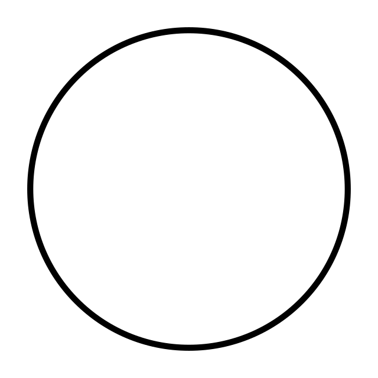

# Lecture 09: Introduction to Geometry (CMU 15-462/662)

In this article we will look at geometric processing and geometric modelling and try to model complex shapes using geometry and understand how to add geometric complexity.

Before we start, we must ask ourselves a simple question: 
#### What is geometry?
1. The study of shapes, sizes, patterns and positions.
2. The study of spaces where some quantity can be measured.

This leads to more questions:
- How to describe a given piece of geometry?
- How can we use digital data to encode shape?
- How to describe a shape?

There are multiple ways of describing something. If you were given the following diagram and were asked to describe it, what would you say?

- The most natural is the linguistic way, which in this case would be saying, the diagram shows a circle.
- In mathematical terms one can express it as: $x^2 + y^2 = 1$. Thia allows you to describe which points lie inside the circle.
- An explicit way to describe it would be: $(cos\theta, sin\theta)$, where the expression represents the $x$ and $y$ values.

These are the most obvious ways of describing the unit circle. Are there any other encodings of it?

Well if you think about it, nothing is stopping you from coming up with more definitions, for example:
- In terms of calculus, you could think of it as the path traced out by the earth around the sun, solution to the equation gives a curve.
- In discrete terms, you could approximate the circle by a polygon and get a discrete representation of it.
- You could say that a circle is entirely symmetric, it stays the same regardless of how much you rotate it.
- One way could be based on the curvature always being 1, i.e., $k = 1$.

The point of this discussion was to show you that there are many different ways to characterise a shape, but the issue with having a million options is the overwhelming aspect they bring along, making it difficult to narrow the options to just one. Hence, one must ask here, given all these options, which is the best way to encode geometry on a computer? To answer this question, we need to look at some more things.

Geometry in the real world can be extremely complex:
- how to show a cloth blowing in the wind?
- how to show water splasing, droplets breaking and merging?
- how to show minute, many details?
- how to show volumetric aspect of a shape?
- how to show the shape of cells, proteins, etc?

We then come up with two big categories of encoding geometry:
1. Explicit representations
Explicit representations have points that represent the surfaces and are plotted to get the required shape.
- point cloud
- polygon mesh (points and connections)
- subdivision, NURBS
2. Implicit
Does not give a defined shape, rather is a question of: am I in the shape or not?
Points are not known directly, more about satisfying a relationship
- level set
- algebraic surface
- L-systems

Each choice is best suited for a different task.
You will need to go back and forth with explicit and implicit

An implicit representation can be described by checking if the point exists in a certain place.
this can thus be very difficult as you do not know where the point is present, e.g. sampling.

**[ insert diagram for implicit representations]**

But the implicit approach is useful when you have the function and you have a point, and you just have to check if the point is present inside the function.

**[ insert diagram for implicit representations with sphere]**

### Explicit Representation
All  the points are given directly, e.g. points on a sphere: $(cos(u)sin(v)), (sin(u)sin(v), cos(v))$ for $0 <= u < 2\pi$ and $0 <= v <= \pi$

### [ diagram of the game and torus ]
(for torus)
We have three numbers but two parameters so how can we use the explicit approach here? It's not possible
Explicit surfaces make tasks like sampling easy, but tests like inside/outside difficult.

### Algebraic Surfaces (Implicit)

A surface is a zero set of a polynomial in $x, y, z$. Examples:
**[insert diagram ]**

What about more complicated shapes? You cannot possibly come up with a unique function/polynomial to represent every shape.

The solution to this is Constructive Solid Geometry (Implicit)
Through this approach, you can build more complicated shapes via Boolean operations.

#### Constructive Solid Geometry (Implicit)
- You are able to build more complicated shapes by applying Boolean operations, e.g. that two shapes are completely separate, two shapes are in union , the intersection of two shapes, the difference of two shapes
You can then chain the expressions one after the other, getting a tree-like structure of Boolean operations that describe the shape.
Doesn't help model organic looking shapes, but does allow to model mechanical shapes like machine parts.

#### Blobby Surfaces 
Instead of using boolean operations, you can gradually blend surfaces together.
We start with two points, then use the Gaussian described in the figure, and when we take the sum at two different points, we see the two bumps intersecting. A similar technique may be adopted to show water droplets merging

**INSERT DIAGRAM**

#### Bending Distance Functions
How to implement Boolean union using distance
**use slides**

#### Level Sets
Implicit surfaces are great at showing nice features like blending and merging, but not so good about to describe complex forms
Instead of using formulas, as that increase complexity and nearly impossible to model complicated shapes, we use grids that allow you to store values, and based on the values in which some are negative and some are positive, you interpolate them, and the places where the result is zero is the surface of the function
This approach provides much more explicit control over the shape, like texture mapping.
Although this seems like a great approach, but you must realise that you have sampled your geometry onto a grid, so  if the resolution is not high enough then features are lost, and in formal terms, this may be terms as aliasing.
You will then need to do sophisticated sampling and filtering to reconstruct the shape.

A big drawback of Level Sets is the storage they require. A 2D surface now requires $O(n^3)$.
A way to go about this is to have a sparce data structure that only stores a narrow band containing the values around the surface. 

## **FRACTALS**

#### Pros and Cons of Implicit Representations
Pros:
- the description can be very compact (e.g., a polynomial)
- easy to determine if a point is in our shape (by just plugging it in)
- other queries may also be easy (e.g., distance to surface)
- for simple shapes you can provide exact descriptions and have no sampling errors
- they allow you to easily handle changes in topology (best for fluid simulation)
Cons:
- expensive to find all points in the shape (e.g., for drawing)
- very difficult to model complex shapes

## Explicit Representations
### Point Clouds
- If you are given a dense set of points, i.e. list of points (x, y, z), you can easily render the surface.
- The points may also include other attributes like colour.
- They allow you to easily represent any kind of geometry as you do not have to approximate any function, but just use the set of points provided.
- Easy to draw a dense cloud, especially if you have a lot more than one point per pixel.
- But it is hard to interpolate under sampled regions
- It is hard to do processing/simulation if you do not have enough points and how one point is connected with another.

### Polygon Mesh
- The most important concept used to represent meshes in computer graphics.
- Instead of storing points, you store vertices and polygons (most often triangles or quads) to represent the surfaces.
- It is easier to do processing/simulation in this way, and results in more adaptive sampling.
- The figure below shows a shape with the front and back in a spherical shape while the rest of it is straight. So we can use triangles to represent the spherical parts, making them in a way that they curve around. While the rest of the shape can be made using long thin triangles.
- This results in a more complicated data structure.
- There are "irregular neighbourhoods". In points, you had points adjacent to one another, representing the object. In a mesh you don't always have a clear view of what might be the adjacent vertices.

### Triangle Mesh
- Store the vertices as tripes of coordinates (x, y, z)
- Store triangles as triples of indices (i, j, k)
- Use Barycentric Interpolation to define the points inside triangles.
- You can think of the triangle mesh as a linear interpolation of a point cloud.

**REVISIT THE BARYCENTRIC INTERPOLATION PROCESSING THEY ARE EXPLAINING**

### Recall: Linear Interpolation
You have Barycentric basis functions and you are using locations in space as the coordinates of these basis functions.
Why should we limit ourselves to *linear* basis functions?
Can we get more interesting geometry using other bases?

Bernstein Basis
- Linear interpolation essentially uses 1st order polynomials
- Provide more flexibility by using higher order polynomials.
- Instead of using the usual basis, i.e. $(1, x, x^2, x^3, ...)$, we use the Bernstein basis:
**INSERT EQUATION AND DIAGRAM**

### Bezier Curves
- A Bezier curve is a curve expressed in the Bernstein basis:
**Insert Equation**
- For n = 1, you just get a line segment.
- For n = 3, you get the "cubic Bezier".
- The Bezier curve has the following important features:
1. Interpolates endpoints
2. Tangent to end segments
3. Contained in convex hull (nice for rasterization)
**Check what the above points mean**
If you want to curve with more control points, what should be done?
Increase the degree of the Bernstein basis?
Although the Bezier curve will interpolate the two points, they only approximate the immediate points. Makes high degree Bezier curves hard to control.
**Insert diagram**

### Piecewise Bezier Curves
A better approach is to piece together many Bezier curves. This is a widely used technique in Illustrator, fonts, SVG, etc.)
**INSERT DIAGRAM**
Formally, the piecewise Bezier curve looks like this:
**INSERT EQUATION AND UNDERSTAND WHAT'S GOING ON**

### Bezier Curves - tangent continuity
To have a nice, seamless transition from one piece to the next, there are two requirements:
1. the endpoints must meet so that there are no gaps.
2. the tangents are the same at the meeting points so that the transition is smooth.
**INSERT DIAGRAM**
It must be noted that each curve is cubic: $u^3p_0 + 3u^2(1-u)p_1 + 3u(1-u)p_2 + (1-u)^3p_3$

A good way to approach this is to count how many constraints and degrees of freedom are there, how many conditions are you trying to satisfy, how many degrees of freedom are you allowed to manipulate?

How many degrees of freedom are there in the 4 points mentioned above ($p1, p2, p3, p4$)? 
Do we think of it as 4 degrees of freedom, or since each of the points has two coordinates, do we think of it as 8 degrees of freedom?

Good to differentiate between scalar degrees of freedom and vector degrees of freedom.

How many constraints are there in this case?
2 - endpoints must meet and tangents must meet. Each of these is a vector condition. The two components of the endpoints have to agree. The two components of the tangent components have to agree.
Not that difficult.

Could you do this with a quadratic Bezier curve? Or a linear Bezier curve?
No you cannot, and one way to think about this would be that 
You have exactly the same number of degrees of freedom as you have contraints. If you reduce the number of curves, you reduce the number of degrees of freedom and you do not get the nice continuity you achieve through cubic curves.

You can get higher order curves, but what about higher order surfaces?

### Tensor Product
, the value at any point $(u, v)$ given by product of a curve f at u and a curve g at v (sometimes called the "tensor product"):
**INSERT DIAGRAM**

### Bezier Patches
You can replace scalar values with vector values for points in space and you get a Bezier Patch.
A Bezier path is the sum of (tensor) products of Bernstein bases.
**INSERT DIAGRAM**

All these bases give a sense of local control.
If we associate each of these bases with a control point, then we can take a linear combination of these basis functions and get a Bezier patch.

So now we have a Bezier patch, how do we get a Bezier surface?
We simply connect the Bezier patches to get a Bezier surface.
But a question arises:
#### Can we always get tangent continuity with Bezier patches?
To answer this we need to consider two more questions:
- How many constraints are present?
- How many degrees of freedom are there?

Bezier patches work great for surfaces where exactly four pathes meet around every vertex, but can be a lot more complicated. Thus, people have come up with other sline patch schemes, e.g. NURBS, Gregory, Pm, polar, etc., and each of these have some tradeoffs, for example:
- degrees of freedom
- continuity
- difficulty of editing
- cost of evaluation
- generality
- etc.

### Rational B-Splines
But there is an issue, Bezier cannot exactly represent conics, not even a circle using curves, and with surfaces, they cannot represent cylinders, and these are very important shapes. How to go about this issue?

The solution is very simple: interpolate in homogeneous coordinates, then project back to the plane, and the result is called a *rational* B-spline.

**INSERT DIAGRAM**

### NURBS
Stands for Non-Uniform Rational B-Splines. In this method we can have knots at arbitrary locations, non uniformly. Things are expressed in homogeneous coordinates and then we do a divide, we get the quotient, which is a rational number. And we have a piecewise polynomial curve which gives us a B-Spline.

#### How do we go from curves to surfaces?
We take a tensor product of the NURBS curves to get a patch:

$S(u,v) = N_i(u)N_j(v)p_ij$
**fix the j**

And we use multiple NURBS patches to form a surface.

Pros of using NURBS:
- easy to evaluate
- make exact conics
- high degree of continuity

Cons:
- hard to piece together/edit many degrees of freedom

### Subdivision
The alternative starting point for curves/surfaces is subdivision. The idea is simple, you start with a control curve and repeatedly split, take weighted average to get new positions, and by splitting over and over and with a careful choice of averaging rule, we approach a nice limit curve.

If you have a carefully chosen averaging rule, you will often get the exact same curves as some of the spline schemes.
There will come a point where the two perspectives (NURBS and subdivision) diverge, things that are easy to do with subdivision and harder to do with NURBS, and vice versa.

#### Is subdivision explicit or implicit representation?
Initially it seems like a vit of a grey area, but you will see that for a given value, you have a deterministic procedure that gives the point on the surface. It is not a test, making it an explicit representation.

## Lane Riesenfeld example (rewatch and write)

### Subdivision Surfaces
1. You start with a polygon mesh (which can be termed as a "control cage")
2. You subdivide each element into some number of pieces.
3. Update the vertices via local averaging
4. There are many possible rules:
      - Catmull-Clark (for quads)
      - Loop (for triangles)
      - ...

The common issues that come with subdivision surfaces are:
- Are they interpolating or approximating? Do the surfaces pass through the vertices of the control cage or just come near them?
- Do we have good continuity at vertices? Do planes meet up and have a nice continuity/curvature?

It is safe to say that subdivision surfaces are easier than splines for modeling, but harder to evaluate pointwise.

**INSERT DIAGRAM**

**INSERT DIAGRAM**
**INSERT DIAGRAM**
**INSERT DIAGRAM**
**INSERT DIAGRAM**
**INSERT DIAGRAM**
**INSERT DIAGRAM**
**INSERT DIAGRAM**

