# Lecture 10: Meshes and Manifolds (CMU 15-462/662)

In this article we will begin looking into how to deal with meshes.
There are many different types of geometry in nature, for which we need a sophisticated representation of geometry.

We looked into implicit and explicit methods when looking into geometry and saw that there were many representations for both.

In this article, we look into what we mean when we use a surface, the nuts and bolts of polygon meshes, and geometry processing/resampling.

## Manifold Assumption
The idea is a bit difficult to understand at first, along with its motivation. Hence, it would be best to first revisit a more familiar example.

Going back to 2D images, during rasterization, we used a regular grid of pixels to encode an image. But images from the real world are not like that, they are not divided into little squares that can represent a pixel. You can see droplets of pigment if it's a picture of a painting, but you do not see any squares.

### So why did we choose a square grid?
There are a lot of possible reasons why squares could be the best choice:
1. Simplicity and efficiency
- a pixel always has four neighboring pixels (except boundaries)
- easy to index and filter (e.g. averaging)
- storage is easy, you can just concatenate the list of rows in one long array
2. Generality
- any kind of image can be encoded into it; you are not limited to encoding only a certain type of image. You can do it with very little compromises.

#### Are regular grids *always* the best choice for bitmap images?
No, they suffer from anisotropy, do not capture edges in images very well, we are able to capture horizontal and vertical edges well, but not the ones at angles.
But more often than not, squares are a good choice, and we will see a similar story with geometry.

#### How should we encode surfaces?
### Smooth Surfaces
Intuitively, a surface is the boundary or "shell" of an object rather than its interior.

Surfaces are manifold:
if you pick any point on your shape and you zoom in far enough, then if it's manifold, you should be able to draw a nice coordinate grid with two distinct directions.

You can think of the earth as manifold, as zooming in to the extreme will still give you something like a street or a house.

So isn't every shape manifold?

No, e.g. in the diagram shown below, regardless of how much you zoom at the center point, you will not be able to clearly represent that point on a grid.

### A manifold polygon mesh has fans, not fins.
Two easy to check conditions:
1. Every edge of the mesh is contained in only two polygons (no "fins").
2. Every vertex in a mesh should be connected as a single fan or loop of polygons.
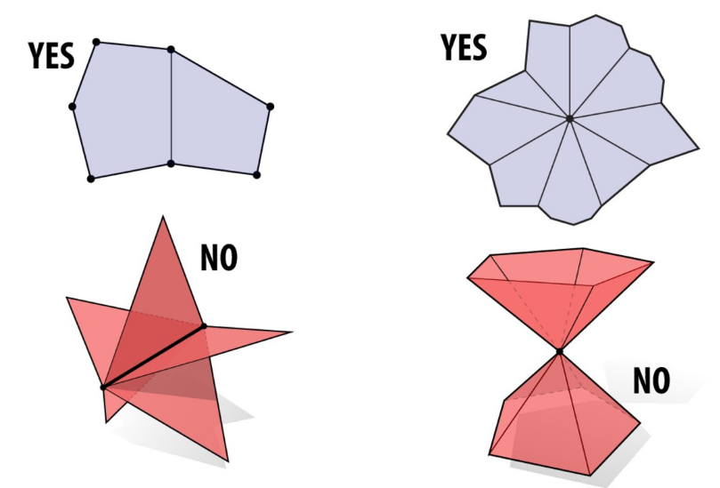

What about boundaries?
Intuitively, a boundary is where a surface "ends", e.g. for a pair of pants, the waist and ankles are the boundaries.

What does it mean for a smooth surface to have a boundary?
Locally, it looks like a half disk, and when you go about it, you return to your initial point as global boundaries form a loop.
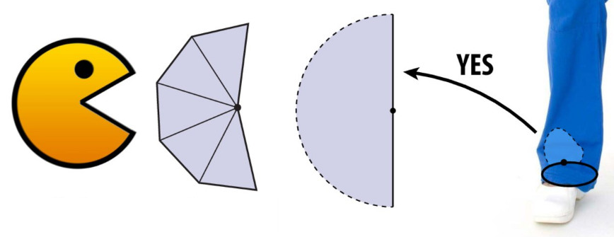

In a polygon mesh, you have one polygon per boundary edge and the boundary vertices look like Pacman, meaning a strip of triangles rather than a loop of triangles.

Polygon mesh is a manifold boundary if every edge is contained in either two polygons in the interior or one on the boundary, and if every vertex is contained on either one loop of polygons or one strip of polygons on a boundary.

#### Why is the manifold assumption a good assumption to make about our geometry?
We want to make assumptions about our geometry to keep data structures/algorithms simple and efficient.

In many common cases, it does not fundamentally limit what we can do with geometry, and we will see how this helps us as we design data structures.

## Designing Data Structures
### Warm up: storing numbers
**What data structures can we use to store a list of numbers?**
1. Use an array 
    - upside: constant time lookup, coherent access.
    - downside: difficult to insert or remove elements from the array.
2. Use a linked list
    - upside: eliminates the issue arrays had posed.

#### Polygon Soup
The most basic idea is that for each triangle, you will just store three coordinates, but no information about connectivity, making it not very different from a point cloud, except those were points and these are vertices.

Pros:
- simple
Cons:
- Redundant storage
- Hard to do much beyond drawing the mesh
- Need spatial data structures (later) to find neighbors

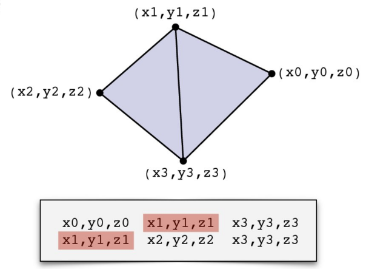

#### Adjacency List (Array-like)
Store triples of coordinates (x, y, z), tuples of indices
We split our shape into a certain geometry and connectivity. You can have the same connectivity with a different geometry.

**How to find all the polygons touching vertex 2?**
Go down the list of polygons and check which one has 2 in its list (i.e. which one is touching vertex 2).
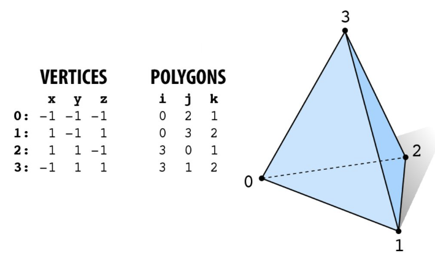

That was simple since we had a simple shape. What if we have the following shape with over 1 billion polygons?

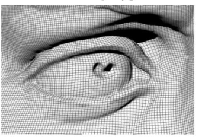

Applying the same method would be extremely expensive as more than 1 billion polygons would have to be searched to find around 4 polygons that meet at that vertex.

#### Incidence Matrices
Indices matrices are a good method to store our data, which allow us to encode all the neighbor information. E.g. for the tetrahedron, we will still store the vertex positions like before as a long list of x,y,z values, but now to store the connectivity, we will use the vertex <-> edge incidence (for every vertex we have a column and every edge we have a row) and we enumerate the edges and vertices in any order. If the entry is 1, that means that the edge and the vertex touch, if it is 0 then they do not touch.

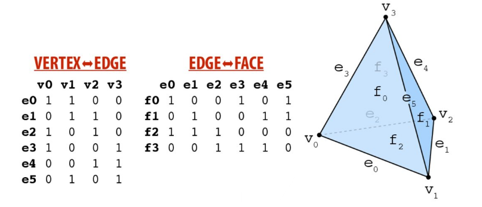

Although we now know the relationships, we do not know if any loops are being formed or which vertices make the triangle, or if there is a hole there. To clear this confusion, we will store another matrix: edge <-> face matrix.

#### Why might this be a bad idea for this very large model?
It requires too much storage. For a billion vertices, a matrix of a billion by billion would be required.
One thing to note is that most mesh elements do not touch other mesh elements, a very tiny fraction is touched by a mesh element, a very small number of vertices is connected to some edges; so instead of storing so many zeros, it would be better to use sparce matrices. Although the storage cost is still high, but finding neighbors now takes O(1).
The best part is that the mesh does not have to be manifold.

#### How do we store a sparce matrix?
1. Associative array - maps a row-column pair. Associates a non-zero value to a non-zero pair (e.g. by using a hash table). Although these allow fast look-ups and fast entries, on the other hand, using this representation, it is a bit difficult to do matrix operations. First the algorithm will need to iterate over these entries, then perform the computations.
2. Array of linked lists - most of the entries of the matrix are zeroes, so for each row, we could store a linked list, representing a list of the non-zero entries. The idea is conceptually simple, but still create the problem of slow access time and incoherent memory access.
3. Compressed column format - it contains tightly pack entries in a dense list.

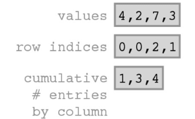

The compressed column format is going to have three different arrays. 

One array is a dense array of values, just the
values of all the non-zero entries.

The second array is the list of row indices, corresponding to the indices of the rows.

These lists are constructed in a very special manner, we start in the upper left entry of the matrix and go down the first column, looking for non-zeros.

In this case, we find a 4 and go over to the next column and get a 2, then a 7, and then we go over to the final column and we get a 3 and we just concatenate all those non-zero values into our first array. We also put in all the row indices, so 4 appears in row zero, 2 appears in row zero, 7 appears in row two and 3 appears in row one.

The final array is a bit different; it tells us what the cumulative number of non-zero entries is per column.

In the first column, we had one non-zero entry; in the second column we had two non-zero entries; so, two plus one is three, and in the third column we had one non-zero entry so one plus two plus one is four.

By looking at this final array, what we can figure out is which segment of the value and index arrays do we need to look at in order to inspect a given column of the matrix. If we wanted to look at the second column e.g., we could start at entry 1 and go to entry 3, stop right before entry 3 so we'd have entries 1 and 2 indexing from zero.

Due to its complex nature, it is difficult to add or modify entries, but very fast for actual matrix operations.

In practice, you often build up entries using an "easier" data structure (e.g. an associative array), write the non-zero entries of a matrix, pass it to a subroutine and it converts it to the compressed column format for computation.

#### Halfedge Data Structure (Linked-list like)
The halfedge data structure is used to store some information about neighbors using just a few key pointers instead of an exhaustive list.

The key idea is that two halfedges act as a "glue" between mesh elements.
One halfedge knows its twin (other halfedge along its edge), then it knows the next edge in the same polygon, it knows the vertex that it comes from, it stores the edge that it belongs to, and it stores the face it belongs to.
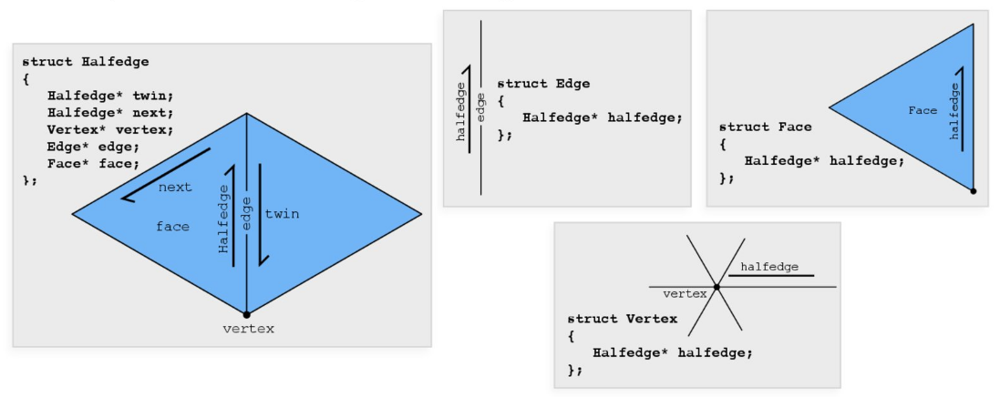

#### Halfedge makes mesh traversal easy
We use the "twin" and "next" pointers to move around a mesh, and we use the "vertex", "edge", and "face" pointers to grab elements.

The following is a pseudocode of how to visit all the vertices of a face:
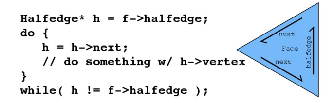

The algorithm will traverse through the linked list, it will reach the end, and then it will return to the start as it makes a loop. But we can grab the vertex at the tail of each of those half edges. If you want to visit all the edges around the triangle, then you would grab the edge from the half edge rather than the vertex.

The following is a pseudocode of how to visit all the neighbors of a vertex:
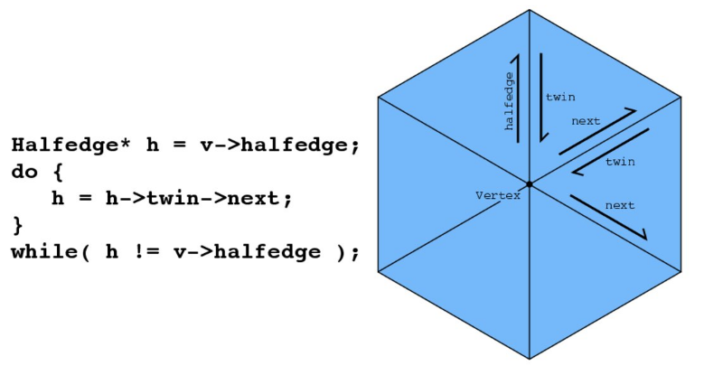

This technique in which we are traversing from face to face, edge to edge, vertex to vertex, only makes sense if the mesh is manifold. This only works with the assumption that there is a single loop of triangles going around the vertex.

**If you have a manifold connectivity, then it will always describe a manifold polygon mesh.**

Only "common sense" conditions are required:
1. The twin of the twin must be the first twin (i.e. the pointer to itself).
2. The twin cannot be the pointer itself.
3. Every halfedge is someone's "next".

- Keep following $next$, you'll get faces.
- Keep following $twin$, you'll get edges.
- Keep following $next->twin$, you'll get vertices.

#### Connectivity vs. Geometry
Manifold had just two conditions:
- every edge was contained in two faces.
- every vertex was contained in one fan.

But these conditions say nothing about vertex positions, they only describe the connectivity. Hence, we can have a perfectly good (manifold) connectivity, even if the geometry is awful. You can have perfectly good manifold connectivity for which any vertex positions give "bad" geometry.

Let's take an example of a cube:

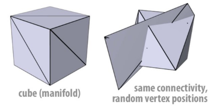

The cube is split up into triangles, it's a nice manifold as every edge is contained by two triangles. We can connect to check that at every vertex we have a loop of polygons.

On the right is exactly the same connectivity, the halfedge data structure remained unchanged, and only the vertex positions are moved around to random locations. Now faces are intersecting and strange things are being seen, but from the perspective of connectivity, it is perfectly fine.
Here is another example: 

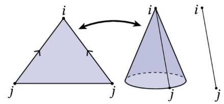

We have a half edge mesh consisting of one triangle, two vertices and two distinct edges. We have taken this flat triangle and glued together two of its edges. This can be represented with a half edge mesh; little half edges can be drawn in here and set up their twins that are next to describe this cone shape. But we only have two vertices, i and j, and so if one tries to do linear interpolation using barycentric coordinates, the best that can be done is to draw a line segment so even though this is a perfectly valid manifold with boundary from the point of view of connectivity, it is kind of collapsed when we try to draw it with linear geometry.

Another similar example:

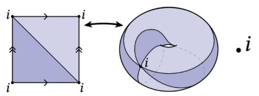

We have manifold connectivity consisting of two triangles and two edges and just one vertex. The edges marked with double arrows get glued together, the edges marked with a single arrow get glued together. Conceptually, this describes kind of a torus, but we only have one vertex position so if we try to draw this with the rasterizer, the best we can do is draw a point in space.

Hence, the geometry that you see on the screen might betray how the mesh is actually connected up and this can lead to confusion when you are debugging. The mesh looks like something is broken even if the connectivity is perfectly correct.

#### Halfedge meshes are easy to edit
A key feature of a linked list is the ability to easily insert or delete elements, which is provided by halfedged meshes. For triangle meshes, there are several atomic operations:
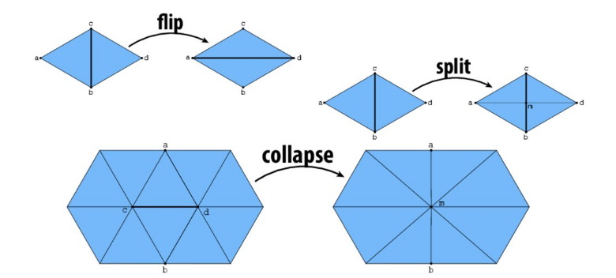

We do this by allocating or deleting elements and reassigning pointers, but in doing so, one must be careful to preserve manifolds.

#### Edge Flip
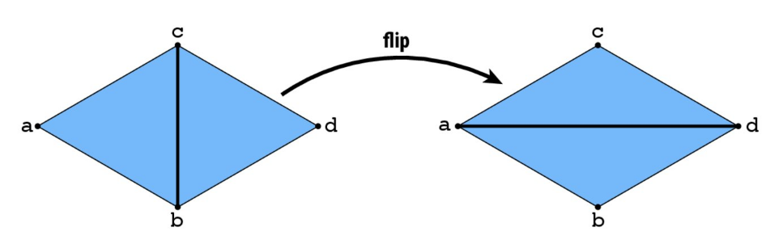

There is a long list of pointer reassignments, but no elements are created or destroyed. And if you flip an edge twice, you return to the original edge configuration.

Challenge: can you implement edge flip such that pointers are unchanged after two flips?
You can have two sets of pointers that represent the same triangle.

#### Edge Split
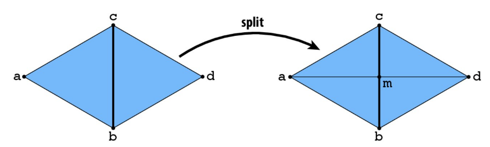

To insert the midpoint m of an edge, you have to add new elements and there are many pointer reassignments.

Can this operation be reversed?
If you are provided with the mesh, it might not be completely obvious which vertices are the inserted ones and which are the original ones, but if the elements are tagged then we can easily remove them.

#### Edge Collapse
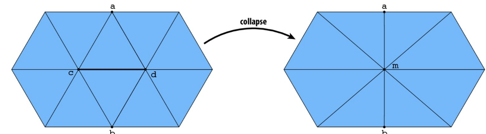

In an edge collapse, elements need to be deleted and new elements need to be inserted, and many pointer assignments will thus be needed. This is easy for an edge contained by two triangles, but not so simple for edges in a general mesh.

**How will we implement operations like this with an adjacency list?**

The main idea behind doing this operation in an adjacency list is to remove certain nodes and add in nodes representing the new elements.

It would be easier to perform this operation on matrices, in which you would just have to set some entries to ones while others to zeros.

#### Alternatives to Halfedge
Due to the issues posed by halfedges, there are alternatives to it, e.g.
- winged edge
- corner table
- quadedge
- and so forth

Each stores local neighborhood information.

There are similar tradeoffs to similar polygon list:
- cons: additional storage, incoherent memory access.
- pros: better access time for individual elements, intuitive traversal of local neighborhoods.

But it is still not impossible to design a halfedge type data structure with coherent data storage, support for non-manifold connectivity, etc.

## Comparison of Polygon Mesh Data Structures
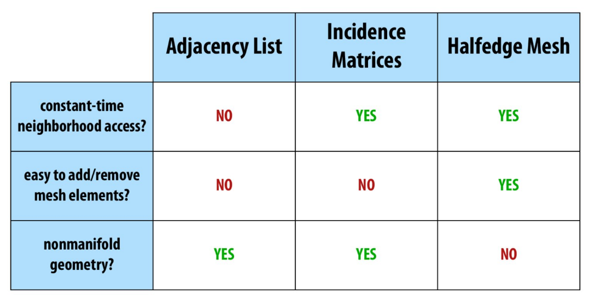

Why do we need a sophisticated data structure?

We need it for subdivision modeling.

### Subdivision Modeling
Common modeling paradigm in modern 3D tools:
- Coarse "control cage"
- Perform local operations to control/edit a shape
- Global subdivision process determines final surface

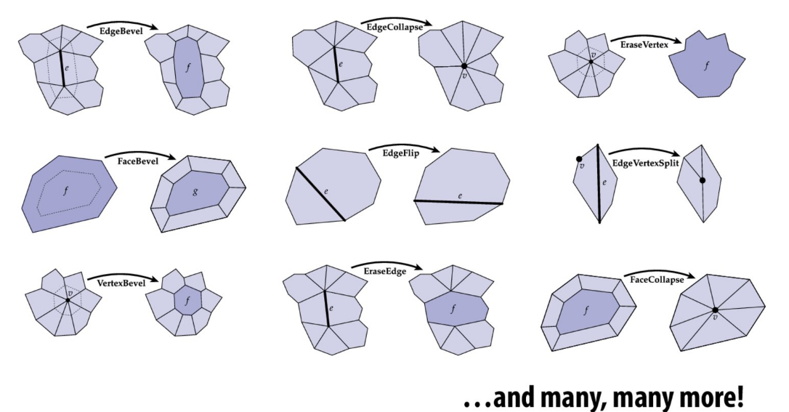
