# Lecture 11: Digital Geometry Processing (CMU 15-462/662)

Digital geometry processing builds upon the concepts of digital signal processing. We will study geometric signals, which also deal with the concepts of signal processing, e.g.
- upsampling
- downsampling
- resampling
- filtering
- aliasing

Beyond pure geometry, these are basic building blocks for many areas and algorithms in graphics, such as rendering and animation.

The geometry processing pipline is not as specific as the rasterization pipeline, but it is broken into three stages:
1. Scan an object in the real world.
2. Process it in an algorithmic way, analyse it, edit it, transform it.
3. Print back out the changes we have made to it.

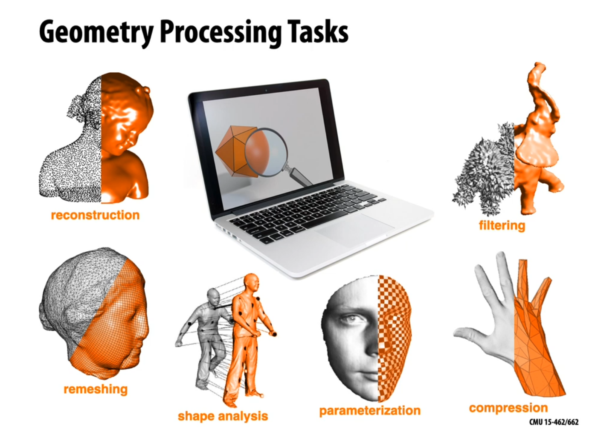

## Geometric Processing: Reconstruction
One basic task in geometric processing is reconstruction. You are given some samples of the geometry, could be a pointcloud, and you would like to reconstruct a surface. 
That point cloud will need to be tranformed into some other useful representation; perhaps that is a polygon mesh, perhaps it is a level set.
Samples can be of different types:
- Quite often you have points and normals. 
- Richer information like knowing that those points and normals came from images that might also give you color information or other information about occlusion, where things are not.
- Line density integrals, in medical imaging if you are trying to image bone and tissue with MRI or CT scans which measure things like what is the total density of that material along a line through space.

#### How do you get a surface?
Different reconstruction techniques are needed to go from those samples to some surface representation. There are many and it depends on what kind of data provided.
- Silhouette-based
- Voronoi-based, use a Voronoi diagram to get a sense of where the surface is
- Partial differential equations
Radon transform for line density integrals by taking volumetric data and turning it into a surface using marching cubes

### Geometric Processing: Upsampling
Upsampling is an important part of geometric processing, which allows you to increase the resolution using interpolation. For images you can use bilinear or bicubic interpolation, while for polygon meshes you can use subdivision, bilateral upsampling, and other techniques.

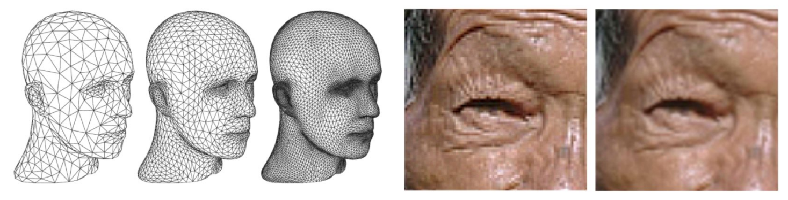

### Geometric Processing: Downsampling
It is a common requirement to decrease resolution but try to preserve shape or appearance. For images nearest-neighbour, bilinear and bicubic interpolation may be used; while for polygon meshes, iterative decimation, variational shape approximation, and such algorithms may be used.

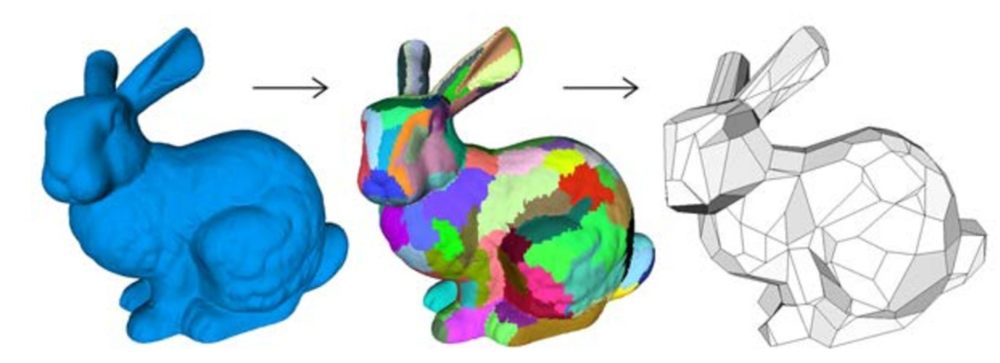

### Geometric Processing: Resampling
Resampling is not used to decrease complexity or the file  size, but to improve quality. Images can be resampled easily as pixels are always stored on a regular grid. For meshes, the shape of the polygons to which you will resample to are very important. The "quality" in this case depends on the task, e.g. for visualisation, the algorithn will try to capture every minute geometric detail, while for solving differential equations, it would be much needed for the polygons to be close to equilateral triangles to reduce complexity and allow easy computation.

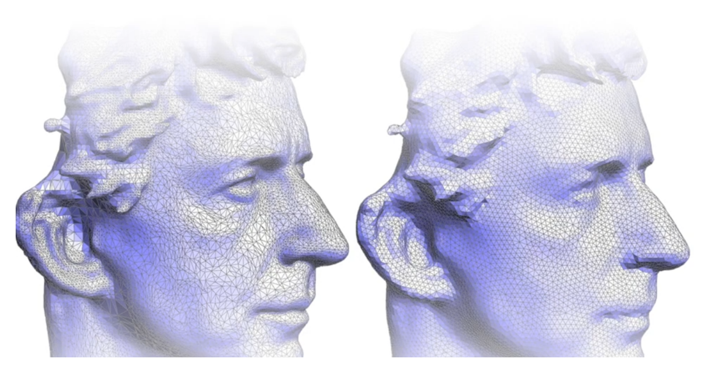

### Geometric Processing: Filtering
Filtering is commonly used to remove noise, but may also be used to emphasize important features, such as edges. In images, filters include blurring, bilateral filtering, edge detection, and more; while in polygon meshes, they are used for curvature flow, we have bilateral filer and spectral filter.

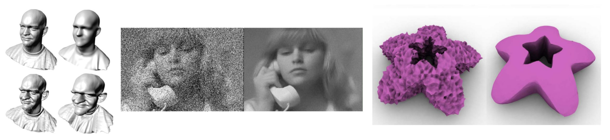

### Geometric Processing: Compression
Compression is usually done to reduce storage size by eliminating redundant data or approximating unimportant data. For lossless compression of images, we can use run-length or Huffman encoding, and for lossy image compression we can use cosine or wavelet; and for polygon meshes, it is not as simple, we can compress geometry, and we will also need to account for connectivity.

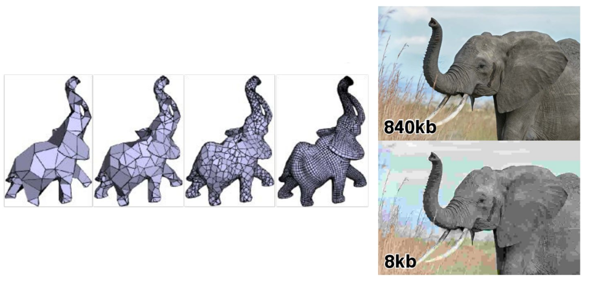

### Geometric Processing: Shape Analysis
This is the ability to identify or understand important semantic features. In images it is used for computer vision, segmentation, face detection, etc. And in polygon meshes we can break them up into meaningful pieces like in segmentation, correspondence, symmetry detection, etc.

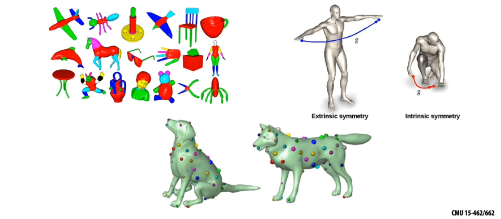

##  Remeshing as resampling
Aliasing exists in geometry the way it does in signals, having less points (undersampling) will results in an inaccurate representation and thus destroys features, and oversampling is bad for performance.

### What makes a good mesh?
It is a good mesh if it provides a good approximation of the original shape.
Keep only useful elements that contribute *information* about the shape.

#### Approximation of positions is not enough
Just because the vertices of a mesh are close to the surface or on the surface it approximates does not mean that it is a good approximation. We can still get the wrong appearance, wrong area, wrong curvature, and other things wrong about the geometry even if the vertices are on the surface.
We need to consider other things apart from if the vertices are close. We need to consider the approximation of surface normals, then a lot of the properties of the surfaces are going to be well approximated.
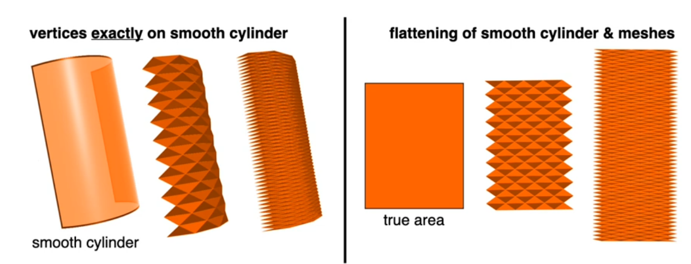

#### What else makes a good triangle?
Rule of thumb: triangle shape - all angles must be close to 60 degrees.

A more sophisticated condition is the Delaunay (empty circumcircles)
- often help with numerical accuracy/stability
- coincide with shockingly many other desirable properties (e.g., maximizes minimum angle, provides smoothest interpolation, guarantees maximum principle...)

Delaunay triangles come with a tradeoff: they do not have the best approximation, which can be achieved by skinny triangles.

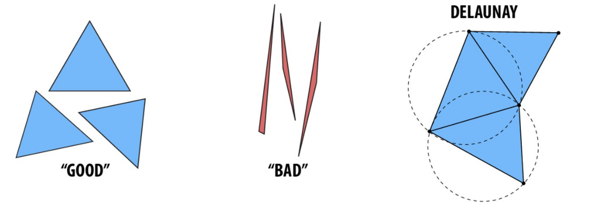

#### What else constitutes a "good" mesh?
It is important for the mesh to have regular vertex degree, meaning, how many vertices meet at a point. So a degree 6 for a triangle mesh would be applicable, and degree four would be for quad mesh.

There is a relationship between regular degree and triangle shape, if the degree is too high, e.g. 10, or if it is too low, e.g. 3, the mesh would be of an irregular shape.

Plus, having regular vertex degrees allows easy mapping of the  region of mesh onto a regular array.
Plus, it also helps in subdivision, which is the method to make smoother. If the degree is something like 6, subdivision will give a smooth surface, whereas if the degree is 20, the subdivision will not give a smooth result.

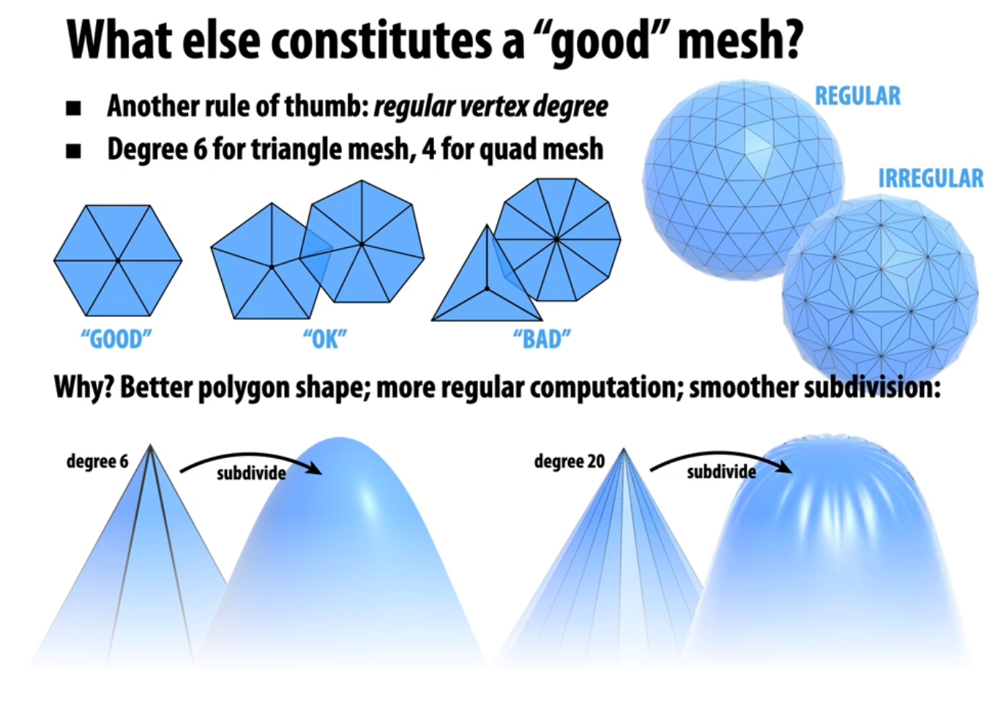

#### How do we upsample a mesh?

### Upsampling via Subdivision

Using subdivision, we will just split elements into smaller pieces, hence the connectivity, then we replace the vertex positions with the weighted average of the vertex positions, thus the geometry.

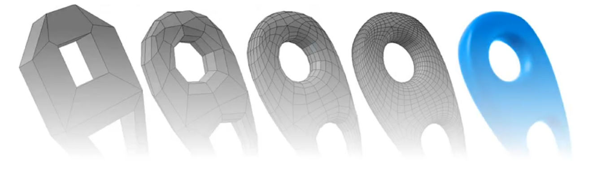

Two different concepts come in subdivision: are we *interpolating* or are we *approximating*?

Does the limit surface pass exactly through the vertices in the control cage or does it just come near the vertices?

The continuity of the surface is also very important as we use subdivision for a smooth approximation. Differentiation may also be involved in this.

We also want to know how does it behave at irregular vertices.

There are many options for subdivision schemes, e.g.
- Quad: Catmull-Clark
- Loop subdivision (very common for triangles)
- Butterfly
- Sqrt(3)
- and more

### Catmull-Clark Subdivision
This is not just for quadrilateral meshes, we can start with a polygon of any kind, and with subdivision, they turn into quadrilaterals.

By using the weighted combination of the old vertices, new vertex positions are created.
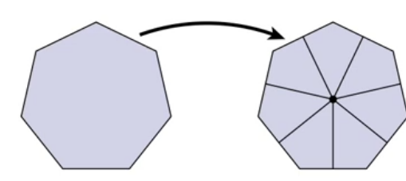

1. We will just take a mean of all the edges.
2. When those are determined, we compute the edge coordinates.
3. The vertex coordinates are calculated using a formula designed for this purpose.

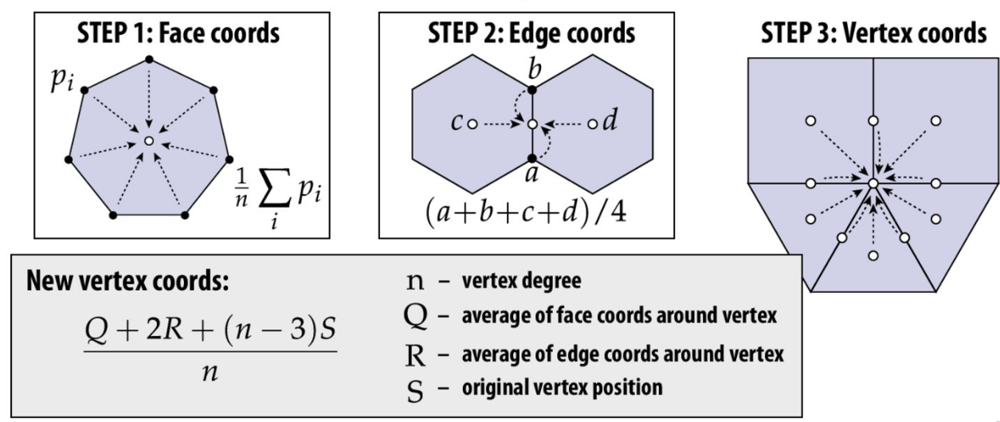

### Loop Subdivision
Loop subdivision is an alternative scheme for triangle meshes, the curvature is continuous away from irregular vertices ("$C^2$"), and uses a similar algorithm with different rules:

1. Split each triangle into four by inserting vertices on the edges.

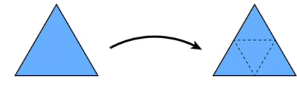

2. Assign new vertex positions based on the weights.

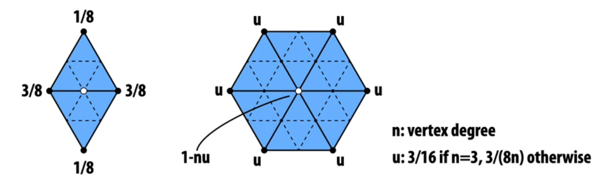

How do we actually change/update the connectivity. We can do pointer reassignments, but we can do atomic edge operations as well.

#### Loop Subdivision via Edge Operations

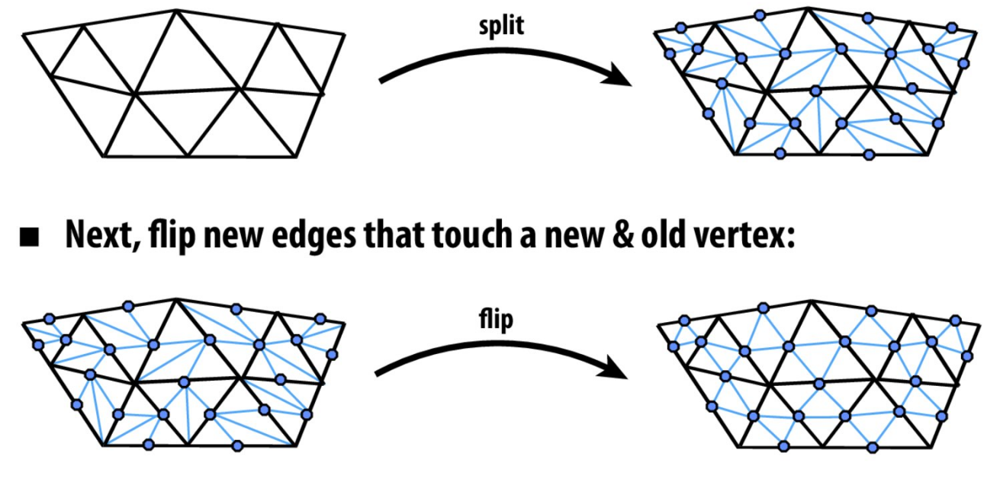

### Simplification via Edge Collapse
A popular scheme is to iteratively collapse edges using the following greedy algorithm:
- assign each edge a cost
- collapse edge with least cost
- repeat until target number of elements is reached.

Although this is a greedy algorithm, it is a particularly effective cost function: *quadric error metric*
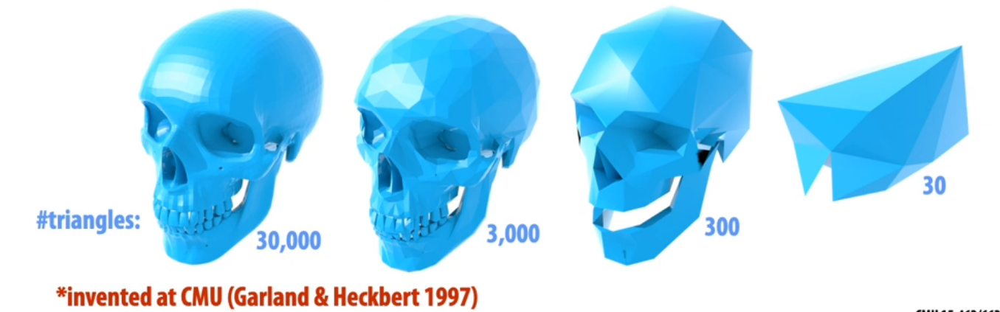

### Quadric Error Metric
This tells us the approximate distance to a collection of triangles. 

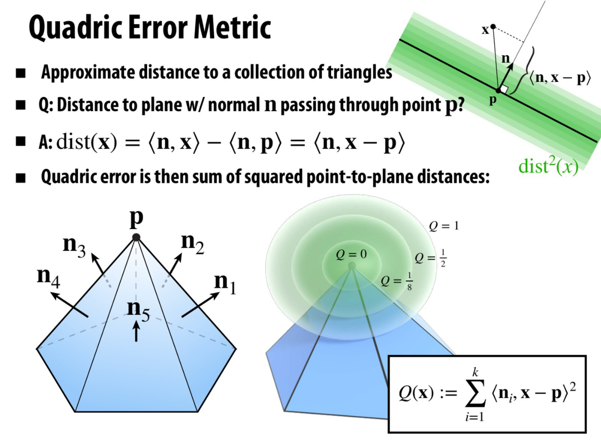

#### Why is the quadric error = 0 at point p?
The quadric error is the sum of the sum of squared point-to-plane distances, it tells how far away are we from the planes in total. The only point that is on all the planes simultaneously is the vertex.

We are not limited to just using this technique for vertex that is a common point for some triangles, but can be used to entire regions of meshes.

### Quadric Error - Homogeneous Coordinates
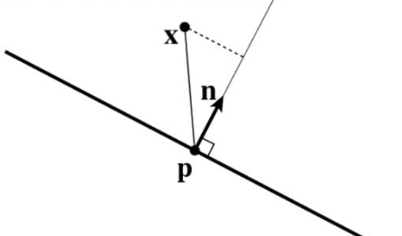

Suppose in coordinates we have:
- a query point **x** $= (x, y, z)$
- a normal n = $(a, b, c)$
- an offset $d = <n,p>$

In homogeneous coordinates, let 
- **u** = $(x, y, z, 1)$
- **v** = $(a, b, c, d)$

The signed distance to the plane is then just <**u**, **v**> = $ax + by + cz + d$

The squared distance is <**u**, **v**>$^2$ = $u^T(vv^T)u = u^TKu$
